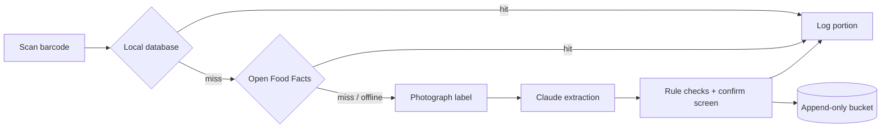

# NutriScan

> **Demo fork** of [EatWell-Studio/NutriScan-MVP](https://github.com/EatWell-Studio/NutriScan-MVP) for the Claude Founder House Stockholm demo. Maintained by Hannes alone; see [FORK.md](./FORK.md).

An offline-first food log with near-zero entry cost. Scan a barcode and the product is logged. If the product is unknown, photograph its nutrition label: Claude extracts the values, rule-based checks flag suspicious fields, and you confirm before anything is stored.

> **Status:** early development. The MVP is being planned and built; there is no application code yet.

## Why

Existing food databases often miss German store brands and Asian products, which leaves manual entry as the fallback. Label recognition is a solved problem. What matters is bringing the cost of recording one item close to zero, and keeping every confirmed extraction as reusable, well-attributed data.

## How it works



- **Offline-first.** The local SQLite database is the source of truth. Scanning, cached hits, logging and the daily summary work without a network connection. Every network call has a timeout and a fallback.
- **Confirm before storing.** Low-confidence fields and fields that fail validation are highlighted and must be confirmed. The checks include the Atwater energy check, mass balance, and sub-item ≤ parent item.
- **Nothing is lost.** The original photo, the raw model output and the normalized record are kept as three separate layers. None of them can be deleted, and confirmed extractions are also written to an append-only object store, so data can be re-processed when models improve.
- **Provenance on every record.** Each nutrient record states its source (`off`, `bls`, `usda`, `vlm_user`, `manual`), so data under different licenses never gets mixed.

## Tech stack

| Layer | Choice |
| --- | --- |
| Client | Flutter (Android first, iOS to follow) |
| Barcode scanning | Native: ML Kit on Android, Apple Vision on iOS |
| Local storage | SQLite via drift; Riverpod for state |
| Label extraction | Claude (Anthropic API) with structured outputs |
| Raw data export | S3-compatible object storage in the EU (Backblaze B2), append-only |
| Later | Supabase (EU) for sync; a FastAPI batch layer for re-processing |

## Repository layout

```
app/      Flutter client
api/      Batch processing layer (later phase)
schema/   Nutrient definitions, VLM prompts, output schemas, codegen, evaluation set
docs/     PRD, development plan, architecture decision records
```

`schema/` is the single source of truth for nutrient fields and the model output format; Dart and Python code are generated from it.

## Roadmap

| Phase | Scope |
| --- | --- |
| 0 | Validation: Open Food Facts hit rate, BLS field survey, label evaluation set |
| 0.5 | Model selection on the evaluation set |
| 1 | MVP: scan and log, photo extraction with confirmation, raw data export, daily summary |
| 2 | Generic foods and home-cooked meals from BLS |
| 3 | Cloud sync (Supabase, EU) |
| 4 | Batch re-processing with new models |
| 5 | Open read-only API and data dumps, filtered by provenance |

## Data sources

| Source | Use | License |
| --- | --- | --- |
| [Open Food Facts](https://world.openfoodfacts.org/data) | Barcode products, live API, cached locally | ODbL |
| [BLS 4.0](https://blsdb.de/download), Max Rubner-Institut | Generic foods (Phase 2) | CC BY 4.0 |
| [USDA FoodData Central](https://fdc.nal.usda.gov/download-datasets) | Not bundled in the MVP | Public domain |

Each source keeps its own license. Provenance lets data be filtered by source on export.

## Documentation

- Product requirements: [English](./docs/PRD.en.md) · [中文](./docs/PRD.md)
- Development plan: [English](./docs/DEV_PLAN.en.md) · [中文](./docs/DEV_PLAN.md)
- [Architecture decision records](./docs/decisions/)
- [Contributing](./CONTRIBUTING.md) (development setup in §9)

## License

The code is licensed under the [MIT License](./LICENSE). Third-party data keeps its own license (see [Data sources](#data-sources)). External code contributions are not accepted during the MVP phase; issues are welcome. The collaboration process is described in [CONTRIBUTING.md](./CONTRIBUTING.md).
