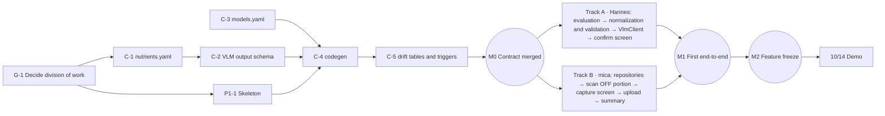

# NutriScan MVP — Development Plan

2026-10-07 · v0.6 (two-person edition)

> Language: English (translation) · [中文（主版本）](./DEV_PLAN.md). The Chinese version is canonical; update both in the same PR.

> **Demo fork**: this repository is the demo fork of upstream; Hannes owns every task, while the "Owner" column still shows the upstream split. Fork rules are in [FORK.md](../FORK.md).

This document breaks the [PRD](./PRD.en.md) down into executable tasks. The PRD says "what and why"; this document says "in what order, how many hours, and what counts as done". This document **contains only the plan and does not track progress**: progress is tracked in GitHub Issues / Projects (see [CONTRIBUTING.md](../CONTRIBUTING.md)). Each decided design decision has its own ADR in [docs/decisions/](./decisions/).

**Target date**: 2026-10-14 is the live demo at Claude Founder House Stockholm (on an Android device). The application to attend the event is still pending; approved or not, development targets 10/14, and the demo-day arrangements are settled once it is approved. Until then, only the contents of the section 4.2 "demo route" are in scope.

**Members and division of work**: the two members of EatWell Studio. `hannesgao` (Hannes) owns Track A, drafts the shared contract, and owns Phase 0 plus the skeleton and CI; `hyhcrh` (mica) owns Track B and reviews the shared contract. See 4.3.

---

## 1. Decisions at a glance

| # | Question | Outcome | Status | ADR |
| --- | --- | --- | --- | --- |
| D1 | App name and package name | Name `NutriScan`; package name `de.belvast.nutriscan` (the reversed domain belvast.de) | Decided | [0016](./decisions/0016-app-id.md) |
| D2 | UI language | Chinese and English ARB files maintained together (the demo audience sees English) | Decided | [0004](./decisions/0004-ui-language.md) |
| D3 | Object storage bucket | Backblaze B2 EU Central; one write-only key per developer | Decided; takes effect once P0-6 hands-on testing passes | [0001](./decisions/0001-object-storage-b2.md) |
| D4 | Nutrient field naming | Internal keys are snake_case with a unit suffix; EuroFIR / OFF / USDA are mapping columns | Decided | [0005](./decisions/0005-nutrient-key-naming.md) |
| D5 | OFF hit rate | Thresholds unchanged (≥ 60% / < 30%); sample expanded to 30+ barcodes | Decided | [0006](./decisions/0006-off-hit-rate-threshold.md) |
| D6 | Bundle USDA | Not bundled in the MVP | Decided | [0007](./decisions/0007-no-usda-in-mvp.md) |
| D7 | ODbL legal review | Done before store release | Decided | [0008](./decisions/0008-odbl-review-before-release.md) |
| D8 | Log first on offline miss | Data model supports it now (`log_entries.nutrient_record_id` nullable); UI deferred until after the demo | Decided | [0009](./decisions/0009-pending-extraction-entries.md) |
| D9 | Provenance of manual input | New enum value `manual`, CHECK constraint written now; `extraction_id` is null for manual input | Decided | [0010](./decisions/0010-provenance-manual.md) |
| D10 | Photos | Store both the original and the derived image (locally + in the bucket), record sha256 for both, strip EXIF from both | Decided | [0011](./decisions/0011-photo-original-and-derived.md) |
| D11 | Bucket object layout | Photos + raw JSON + `_confirmed.v<N>.json`; key rule for items without a barcode; contributor is the GitHub username; raw JSON records contributor, model, effort, token counts | Decided | [0012](./decisions/0012-bucket-object-layout.md) |
| D12 | State management / local DB | Riverpod + drift | Decided | [0013](./decisions/0013-riverpod-drift.md) |
| D13 | Secrets | Anthropic: a dedicated NutriScan workspace under Hannes's Startup account, with a workspace monthly limit and one key per person (D21); `secrets.example.json`; password manager; gitleaks in CI | Decided | [0014](./decisions/0014-secrets-and-api-keys.md) |
| D14 | VLM model | Decided after the phase 0.5 evaluation. Candidates: Opus 5.5 / Sonnet 5 (Haiku 4.5 has been dropped); Fable 5.1 only as an accuracy-ceiling reference. Criteria in order: silent error rate → P90 ≤ 25 s → cost | Process decided, **model pending evaluation** | [0002](./decisions/0002-vlm-model-selection.md) |
| D15 | Mistral | Only in the evaluation script; not implemented in the app before the demo; third among EU fallbacks | Decided | [0003](./decisions/0003-mistral-eval-only.md) |
| D16 | Code license + contribution terms | MIT during the MVP phase, for maximum freedom in coding; no DCO or CLA during the MVP phase, and no external code contributions. Code ownership: see D18 | Decided | [0021](./decisions/0021-mit-license-for-mvp.md) |
| D17 | Server-side proxy milestone | In-EU inference (Vertex AI EU) and "no secrets on the client" merged into a single milestone; a prerequisite for any external distribution and for phase 5 | Decided | [0015](./decisions/0015-server-proxy-milestone.md) |
| D18 | Code ownership | The code is jointly owned by the two members of EatWell Studio | Decided | [0017](./decisions/0017-code-ownership.md) |
| D19 | Does the collaborator count as the "second real user" | Yes. The PRD trigger for introducing cloud sync (phase 3) is therefore met; start date TBD (7.2) | Decided | [0018](./decisions/0018-collaborator-is-second-user.md) |
| D20 | Demo platform | The 10/14 demo uses Android; the iOS version follows after the demo | Decided | [0019](./decisions/0019-android-first-demo.md) |
| D21 | How we use Claude | **Development** (Claude Code): Hannes uses a Claude Max subscription; mica uses a trial pass that expires on 10/2 and then switches to Pro. **API**: option A, prepaid through Hannes's Startup account, for evaluation, debugging and the demo | Decided | [0020](./decisions/0020-claude-access.md), [0022](./decisions/0022-prepaid-api-before-demo.md) |
| D22 | CI | Flutter, Dart and Python use the current latest stable releases, pinned to exact versions; gitleaks runs in CI as the command-line tool (no license needed); commit prefixes are standardized and the body must include `Refs:` with the task ID; once CI exists, its jobs become required checks on main. Version baseline in ADR 0023 | Decided | [0023](./decisions/0023-ci-architecture.md) |


---

## 2. Repository skeleton and engineering conventions

Target structure before the demo:

```
CLAUDE.md               Claude Code working rules (shared by both)
.gitignore
CONTRIBUTING.md         Collaboration process
.github/                CODEOWNERS, PR template, workflows/
secrets.example.json    Secrets template (the real secrets.json is never committed)
app/                    Flutter client
  lib/
    generated/          ← codegen output, never edit by hand (checked in CI)
    data/
      db/               drift table definitions, migrations, triggers (shared contract)
      repositories/
      clients/          off/ vlm/ bucket/ (all with timeouts)
      upload/           upload queue worker
    domain/             Pure Dart: normalization, rule validation, portion conversion
    features/           scan/ capture/ confirm/ portion/ summary/
    l10n/               app_zh.arb, app_en.arb
  test/
api/                    Only a README until phase 4
schema/
  nutrients.yaml        Single definition of nutrient fields (shared contract)
  nutriscan_schema/     Pydantic v2: VLM output structure (shared contract)
  prompts/              vlm_extract.v1.md … (file name = version; frozen once it has produced data)
  codegen/              Generates JSON Schema and Dart code
  generated/            vlm_output.v1.schema.json (standard), vlm_output.v1.claude.schema.json (Claude variant)
  eval/
    models.yaml         Single definition of model IDs, prices, image limits (shared contract, see 3.7)
    images/ ground_truth/ results/ run.py
  tools/                One-off scripts for phase 0
docs/
  PRD.md  PRD.en.md  DEV_PLAN.md  DEV_PLAN.en.md  LICENSES.md  decisions/  notes/
```

**How "schema as the single source" is implemented**

- `schema/nutrients.yaml`: the single definition of the nutrient **list**.
- `schema/nutriscan_schema/`: Pydantic models that read nutrients.yaml and define the VLM output **structure**.
- `schema/eval/models.yaml`: the single definition of models and prices.
- `schema/codegen/generate.py` produces, with one command:
  1. `schema/generated/vlm_output.v<N>.schema.json`: standard JSON Schema with constraints such as `minimum` / `maximum`, used for validation on the Python side.
  2. `schema/generated/vlm_output.v<N>.claude.schema.json`: a variant that meets Claude's structured output requirements (see 3.6).
  3. `app/lib/generated/nutrients.g.dart`: nutrient enum, units, label order, parent/child relations, mapping table.
  4. `app/lib/generated/models.g.dart`: the model ID, effort and image limits currently used by the app.
  5. `app/lib/generated/vlm_output.g.dart`: Dart parser classes for the VLM output, **added after the demo**. Before the demo, `app/lib/data/clients/vlm/vlm_output.dart` is written by hand, with a test that checks it matches the standard JSON Schema.
- CI reruns codegen and then runs `git diff --exit-code`.

**Other conventions**

- The repository is **public**: no secret may ever enter git history; all photos have EXIF stripped; CI runs gitleaks.
- **Documentation language**: PRD and DEV_PLAN exist in Chinese and English (Chinese is canonical; changes must update both in the same PR); all other documents (CLAUDE.md, CONTRIBUTING.md, ADRs, PR template, code comments) are English only.
- External data licenses are documented in `docs/LICENSES.md` and referenced from code comments (PRD rule 10).
- Commits, branches, PRs and merge strategy: see CONTRIBUTING.md.

---

## 3. Key technical details

### 3.1 Local database (drift / SQLite)

**All primary keys are UUIDs (v7, text)**, not auto-increment integers: each of the two development devices has its own local database, and bucket objects and future sync both need globally unique IDs.

| Table | Layer | Main columns | Deletion | Immutable columns (BEFORE UPDATE triggers) |
| --- | --- | --- | --- | --- |
| `products` | — | `id`, `barcode` (unique, nullable), `brand`, `name`, `created_at` | Never deleted (no delete code path) | `id`, `barcode` |
| `photos` | Layer 1 | `id`, `product_id`, `kind` (`original` / `derived`), `derived_from` (derived image points to its original), `local_path`, `sha256`, `width`, `height`, `taken_at`, `bucket_key`, `upload_status` | **Blocked by trigger** | All except `bucket_key`, `upload_status` |
| `extractions` | Layer 2 | `id`, `photo_id` (the derived image sent to the model, NOT NULL), `input_image_sha256`, `model`, `effort`, `prompt_version`, `schema_version`, `contributor`, `status` (`pending` / `done` / `failed` / `unreadable`), `raw_json`, `input_tokens`, `output_tokens`, `latency_ms`, `created_at` | **Blocked by trigger** | All except `status`; `raw_json`, token counts and `latency_ms` may be written once from NULL and are immutable afterwards |
| `nutrient_records` | Layer 3 | `id`, `product_id`, `version`, `provenance` (NOT NULL, CHECK ∈ `off` / `bls` / `usda` / `vlm_user` / `manual`), `source_version`, `source_retrieved_at`, `extraction_id`, `contributor`, `basis`, `original_basis`, `serving_text`, `serving_amount`, `serving_unit`, `source_raw`, `confirmed_at` | **Blocked by trigger** | All |
| `nutrient_values` | Layer 3 | `record_id`, `nutrient_key`, `value_per_100`, `value_original`, `user_edited`, `derived` | **Blocked by trigger** | All |
| `log_entries` | User log | `id`, `product_id`, `nutrient_record_id` (nullable = pending extraction, D8), `consumed_at`, `amount`, `unit`, `deleted_at` | Soft delete | None |
| `upload_queue` | Export | `id`, `object_key`, `local_path`, `content_type`, `sha256`, `status`, `attempts`, `last_error`, `next_attempt_at`, `uploaded_at` | Never deleted (status changes only) | `object_key`, `local_path`, `sha256` |

Constraint highlights:

- **Consistency between provenance and extraction** is a CHECK: `provenance = 'vlm_user'` if and only if `extraction_id IS NOT NULL`. Manual input (`manual`) has no extraction row (D9).
- **Append-only triggers**: all four three-data-layer tables get `BEFORE DELETE … RAISE(ABORT)`, plus `BEFORE UPDATE OF <column> … RAISE(ABORT)` for the immutable columns listed in the table. "Write once from NULL" is implemented with `WHEN OLD.<column> IS NOT NULL`. Columns that need updates (`status`, `bucket_key`, `upload_status`) get no trigger.
- **Migration tests**: drift schema snapshots (`drift_dev schema dump`) plus migration tests. After migrating from every historical version to the latest one, assert that the trigger list in `sqlite_master` matches the expected set exactly.
- These are local SQLite triggers and do not violate PRD rule 7 (that rule targets Supabase).
- **Versioning**: a new nutrient record for the same product gets `version + 1`; the "current record" = latest `confirmed_at`; `log_entries` point to a specific version.

### 3.2 Normalization rules

`app/lib/domain/normalize.dart`, pure functions.

| Case | Handling | Before demo |
| --- | --- | --- |
| Label has a per 100g / 100ml column | Take that column directly | ✓ |
| Only one of kJ and kcal | Fill in the other with 1 kcal = 4.184 kJ, marked as derived | ✓ |
| Only sodium / only salt | Salt = sodium × 2.5, filled in either direction, marked as derived | ✓ |
| Total sugar / added sugar | Two separate fields; "davon Zucker" maps to total sugar | ✓ |
| Dietary fiber | Separate field; records whether the source regulation counts it in carbohydrates | ✓ |
| Only per serving | Needs the serving size in grams / milliliters for conversion; before the demo: flag red and ask the user to enter per-100 values manually | Conversion post-demo |
| Solid vs liquid | No conversion between `per_100ml` and `per_100g` | ✓ |

### 3.3 Rule validation

`app/lib/domain/validate.dart`, pure functions returning `List<ValidationIssue>`; rerun after every edit on the confirm screen.

| Rule | Condition | Source |
| --- | --- | --- |
| Atwater | \|P×4 + C×4 + F×9 − kcal\| / kcal > 15% | PRD |
| Atwater low-energy exemption | When the declared value is < 40 kcal, use absolute deviation > 8 kcal instead | Addition |
| Mass balance | Fat + carbohydrate + protein + fiber + salt ≤ 100 g (relaxed to 110 for per 100ml) | PRD |
| Sub-item ≤ parent | Saturated fat ≤ fat; sugar ≤ carbohydrate | Addition |
| kJ / kcal consistency | \|kJ − kcal × 4.184\| / kJ > 5% | Addition |
| kJ / kcal low-energy exemption | When kcal < 20, use absolute deviation instead: \|kJ − kcal × 4.184\| > 5 kJ. Label values are rounded to integers, so relative error is meaningless at low energy | Addition |
| confidence out of range | Outside [0, 1] is treated as a parse error (Claude structured outputs do not support numeric range constraints, so this is enforced here; see 3.6) | Addition |
| Low confidence | confidence < threshold (calibrated against ground truth in phase 0.5) | PRD |

Whether these thresholds are appropriate, and whether Atwater should include fiber × 2 kcal/g, are both determined in P05-5 using the evaluation set.

### 3.4 External calls and degradation

| Call | Timeout | On failure |
| --- | --- | --- |
| Local SQLite barcode lookup | — | Main path, feedback in < 1 second |
| OFF `GET /api/v2/product/<barcode>?fields=…` | 4 s | One-line notice, then go to capture; sends a proper User-Agent; called only on a real scan |
| Claude Messages API (HTTP, no official Dart SDK) | 25 s, cancellable | Offline: extraction recorded as `pending` (D8); online but failed / cancelled / `stop_reason` is `refusal` or `max_tokens`: switch to manual input |
| Bucket upload | 30 s / object | Stays in the queue. Retry triggers before the demo: app start, return to foreground, after each confirmation; exponential backoff added post-demo |

Opus 5.5's thinking mode is always on and cannot be disabled; the default effort is `medium` ([effort docs](https://platform.claude.com/docs/en/build-with-claude/effort)). The effort used by the app is determined by the D14 evaluation results, written into `models.yaml`, and reaches the app via codegen.

### 3.5 Photos (D10)

1. The `camera` plugin takes the photo, output goes to a temp directory. Immediately after capture, the file is moved to the app documents directory as `photos/<uuid>.orig.jpg`.
2. First bake the rotation into the pixels according to EXIF Orientation, then **strip all EXIF** (including GPS) and re-encode. The original gets the same treatment. sha256 is computed **after** stripping EXIF.
3. The derived image satisfies both limits of the selected model: the long-edge pixel limit and the visual token limit (`⌈w/28⌉ × ⌈h/28⌉`). Both values are read from `models.yaml`. If either is exceeded, the API rescales the image before processing ([vision docs](https://platform.claude.com/docs/en/build-with-claude/vision)), and then "the bytes the model actually saw" would no longer match the archive.
4. `photos` gets two rows (`original`, `derived`); `extractions.input_image_sha256` records the hash of the derived image.

### 3.6 VLM output structure and the Claude variant

v1 draft (finalized in P05-2). Design principle: **all fields required, nullable fields kept to a minimum**.

```json
{
  "schema_version": "1",
  "unreadable": false,
  "product_name_guess": "string (empty string if unknown)",
  "columns": [
    {"id": "c1", "basis": "per_100g | per_100ml | per_serving", "serving_text": "string (empty string if none)", "serving_amount": "number | null", "serving_unit": "g | ml | null"}
  ],
  "nutrients": [
    {"key": "<enum generated from nutrients.yaml>", "column": "c1", "value": 1523, "raw_text": "1523 kJ", "confidence": 0.95}
  ]
}
```

Only two fields are nullable: `serving_amount` and `serving_unit`.

Limitations of Claude structured outputs ([structured outputs docs](https://platform.claude.com/docs/en/build-with-claude/structured-outputs)), each handled by codegen when generating the Claude variant:

| Limitation | Handling |
| --- | --- |
| Every object must have `additionalProperties: false` | Added to every object in the variant |
| `minimum` / `maximum` / `multipleOf`, `minLength` / `maxLength` are not supported; array constraints only support `minItems` of 0 or 1 | Removed from the variant; enforced on the Dart side by `validate.dart` instead (e.g. confidence ∈ [0, 1]) |
| There are caps on the total number of optional parameters and on union types (including nullable `anyOf`); an overly complex schema returns 400 | All fields required; only 2 nullable |
| `pattern` supports only simple regular expressions | v1 does not use `pattern` |

**P05-2 acceptance test**: actually send the generated Claude variant to the API (one minimal request per candidate model) and assert no 400 is returned. The test needs a key, is marked `live`, runs manually on a local machine, and is not part of PR CI.

- The confidence self-reported by the VLM is not a calibrated probability; it is only a hint. The real gate is the rule validation in 3.3, plus the silent error rate measured in P05-4.
- `raw_text` is kept so that, when something goes wrong, an OCR misread can be told apart from a mapping error.

### 3.7 Model configuration (single source)

`schema/eval/models.yaml` is the **single place** where model IDs, prices and image limits are defined. The PRD, DEV_PLAN and ADRs only name models; they never contain IDs or prices. When a new model comes out, add one line here. Fields per row:

| Field | Description |
| --- | --- |
| `id` | API model ID |
| `provider` | `anthropic` / `mistral` |
| `role` | `candidate` / `reference` (Fable 5.1) / `backup` (Mistral) |
| `price_input_per_mtok`, `price_output_per_mtok` | USD |
| `max_image_long_edge_px`, `max_visual_tokens` | Used by 3.5 |
| `supports_effort`, `effort_levels` | Used by the evaluation matrix |
| `source_url`, `verified_on` | Official docs link and verification date |

There is also a top-level field `app_default: {model, effort}`, from which codegen generates `models.g.dart`. Until D14 is decided, `app_default` temporarily uses the officially recommended default starting point, Opus 5.5 + `low`.

### 3.8 Bucket object layout (D11)

Full rules in [ADR 0012](./decisions/0012-bucket-object-layout.md). Highlights:

- Object key prefix: `raw/<YYYY>/<MM>/<subject>_<UTC yyyyMMddTHHmmssZ>_<contributor>`.
  - `subject` is the barcode. Without a barcode, use `nobarcode-<product_id>`.
  - All files from the same capture share this prefix, followed by a suffix: `.orig.jpg`, `.jpg` (derived image), `.raw.json`, `_confirmed.v<N>.json`.
- When the user later edits a record and a new version is created, another `_confirmed.v<N+1>.json` is appended; old files are never overwritten.
- `.raw.json`: the verbatim API response, plus `model`, `effort`, `prompt_version`, `schema_version`, `input_image_sha256`, `original_sha256`, `input_tokens`, `output_tokens`, `latency_ms`, `contributor`, `requested_at`.
- The bucket client only exposes `put`.

---

## 4. Hours, dependencies and tasks

This section estimates hours and lays out dependencies; it **does not set a schedule**, which the two of you arrange yourselves. Owners are in 4.3 and in the "Owner" column of the task tables.

### 4.1 Hours summary

"Person-hours" are rough estimates with high uncertainty. Items listed as post-demo in section 4.2 are excluded, and the estimate covers Android only (D20).

| Category | Tasks | Person-hours |
| --- | --- | --- |
| Preparation | G-1 – G-4 | 6 |
| Phase 0 · Validation | P0-1, P0-2, P0-4 – P0-7 | 11 |
| Shared contract | C-1 – C-5, C-R | 17.5 |
| Skeleton and CI | P1-1, P1-2 | 5.5 |
| Track A: schema, VLM, evaluation, confirm screen | P05-3 – P05-5, P1-4, P1-11 – P1-14, P1-16 | 29 |
| Track B: scan, OFF, capture, portion, upload, summary | P1-5 – P1-10, P1-17, P1-19 | 25.5 |
| Integration and demo | I-1, I-2, DEMO-1 | 14 |
| **Task subtotal** | | **108.5** |
| PR review | About 22 PRs × 0.4 h | ~9 |
| **Total** | | **~118** |

Split by person (review excluded; tasks done by both count half for each):

| Owner | Contents | Person-hours |
| --- | --- | --- |
| Hannes | Half of G-1 and G-3, G-2, G-4; Phase 0 (half of P0-4 and P0-5); C-1 – C-5; skeleton and CI (P1-1, P1-2); Track A; half of I-1, I-2, DEMO-1 | ~70 |
| mica | Half of G-1 and G-3; half of P0-4 and P0-5; C-R; Track B; half of I-1, I-2, DEMO-1 | ~39 |

Split by convergence point:

| Span | Contents | Person-hours |
| --- | --- | --- |
| Up to M0 (Contract merged) | Preparation + shared contract + skeleton and CI | 29 |
| In parallel with the row above | Phase 0 (the evaluation set must be done before P05-4) | 11 |
| M0 → M2 (Feature freeze) | Track A + Track B + I-1 + I-2 | 64.5 |
| M2 → demo | DEMO-1 | 4 |

**Critical path** (the part that can only run serially and cannot be shortened by adding people): G-1 → C-1 → C-2 → P1-1 → C-4 → C-5 → C-R → P1-4 → P1-11 → P1-12 → P1-14 → I-1 → I-2 → DEMO-1, about **45 hours**. Everything except C-R (mica) is on Hannes; P1-1, P1-4 and P1-11 are all Hannes's and therefore run serially, and the P1-1 skeleton must be merged before C-4. So the shortest calendar time depends mainly on how many hours per day Hannes can put in, and on how fast contract PRs are reviewed.

### 4.2 Demo route (must work before 10/14)

On the demo device (**Android**, D20), perform the following live, in order:

1. **Offline scan of a cached product**: in airplane mode, scan a cached product; the portion screen appears and the entry is logged.
2. **OFF hit**: online, scan a product that is in OFF but not cached locally; logged in one step.
3. **Capture → Claude extraction → confirm screen** (the core of the demo; the API is prepaid through Hannes's Startup account, see D21): scan a product that is not in OFF, photograph the nutrition label, and reach the confirm screen, where fields that fail validation or have low confidence are highlighted. After changing a value, validation reruns immediately (e.g. change 12 to 1.2 and Atwater turns red at once). Confirm and log.
4. **Daily summary**: show the totals and the entry list, delete one entry.
5. **Bucket**: open the B2 console and show the original image, derived image, `.raw.json` and `_confirmed.v1.json` from that capture.

**Deferred until after the demo**:
- iOS version (signing, camera and permissions, on-device testing)
- P1-15 pending extraction UI (the data model is built now), P1-18 settings page, P1-21 one week of continuous use
- Phase 2 (BLS), P0-3
- CI refinement (path filters, separate workflows)
- Mistral client in the app, codegen for the VLM output parser classes
- Per-serving conversion, upload exponential backoff
- Enlarging the original image on the confirm screen, ml on the portion screen, editing portions on the summary screen

### 4.3 Two parallel tracks and convergence points

The work splits by dependency into two tracks that can run in parallel: **Hannes owns Track A, mica (`hyhcrh`) owns Track B**. Hannes drafts the shared contract (C-1 – C-5) and mica reviews it; the contract drafts (especially the data-structure parts C-1, C-2, C-5) are planned for review on 9/27–9/28. Once the contract is merged, the two tracks run in parallel. Hannes owns the Phase 0 tasks that had no owner, and also owns the skeleton and CI (P1-1, P1-2).



| Convergence point | Suggested date | Completion criterion |
| --- | --- | --- |
| **M0 Contract merged** | Around 10/1 | C-1 – C-5, P1-1 and P1-2 are all merged into main |
| **M1 First end-to-end** | Around 10/8 | On a real Android device: scan miss → capture → Claude → confirm screen (a simple version is fine) → portion → log, with the matching rows appearing in the upload queue |
| **M2 Feature freeze** | Around 10/11 | The 4.2 demo route runs completely on the demo device; after this, bug fixes only, no new features |

**Interfaces between the two tracks** (settled in C-5, first written as interfaces plus stub implementations, so each side develops against the interfaces):

| Interface | Provider | Consumer |
| --- | --- | --- |
| `ProductRepository.findByBarcode` / `saveFromOff` | Track B | Track B (scan flow), Track A (write after confirmation) |
| Capture route: input `productId`, returns `{originalPhotoId, derivedPhotoId}` | Track B | Track A (confirm screen entry) |
| Confirm route: input `productId` and an optional `derivedPhotoId`, returns `{nutrientRecordId}` | Track A | Track B (lookup flow) |
| Portion route: input `productId` and an optional `nutrientRecordId` | Track B | Track A |
| `UploadQueueRepository.enqueue(objectKey, localPath, contentType, sha256)` | Track B | Track A (P1-14) |
| `BucketKeys`: generates the object keys from 3.8 | C-5 (contract) | Both |

### 4.4 Task tables

"Owner" column: `Hannes` and `mica` are the owners; `Both` means both of you take part; `TBD` means not assigned yet. "Est. (h)" is in person-hours; tasks marked "Both" are written as "per person + per person".

#### Preparation (G)

| Task | Contents | Owner | Depends on | Est. (h) |
| --- | --- | --- | --- | --- |
| G-1 | Decide D16, the division of work and D21 | Both | — | 1+1 |
| G-2 | GitHub: set up branch protection and rebase-only per the table in CONTRIBUTING; create an issue for every task and a Project board; update CODEOWNERS once the division of work is agreed | Hannes | G-1 | 1.5 |
| G-3 | Development tools: Hannes uses Claude Max; mica uses the trial pass (expires 10/2), then switches to Pro. API (D21, ADR 0022): create a dedicated NutriScan workspace under Hannes's Startup account, set the monthly limit, one key per person (distributed through the password manager) | Both | — | 0.5 |
| G-4 | ADR workflow and review conventions: when an ADR gets its own PR, status flow, PR template options; reviewer checklist, comment prefixes, review summary format; toolchain ADRs (e.g. ADR 0025) | Hannes | G-1 | 2 |

#### Phase 0 · Validation

| Task | Contents | Owner | Depends on | Est. (h) |
| --- | --- | --- | --- | --- |
| P0-1 | Collect 30+ barcodes from shopping receipts (including Rewe / Lidl / Kaufland / Alnatura private labels and Asian products) | Hannes | — | 1 |
| P0-2 | `schema/tools/off_probe.py` measures the hit rate, written up in `docs/notes/off-hit-rate.md`; also picks the "OFF hit" and "not in OFF" products for the demo | Hannes | P0-1 | 1.5 |
| P0-3 | BLS field notes | Hannes | — | **Post-demo** |
| P0-4 | 30+ evaluation photos, **supermarket or products already at home are both fine**, each of you shoots half; cover per 100g / per serving columns, kJ/kcal side by side, glare, curved packaging, small print, at least 3 non-German labels; strip EXIF before committing | Both | — | 1.5+1.5 |
| P0-5 | Each of you enters the ground truth for the half you shot (seven core fields + reference quantity) | Both | P0-4 | 1.5+1.5 |
| P0-6 | B2 hands-on testing, results written into ADR 0001: deletion with the write-only key is refused; a same-name PUT creates a new version and the old version remains; behavior of the hide operation; whether this key can modify lifecycle rules. Create one key per person | Hannes | — | 2 |
| P0-7 | `docs/LICENSES.md`; OFF (ODbL) data attribution in the app (OFF data is shown during the demo) | Hannes | — | 0.5 |

#### Shared contract (C): done by one person, reviewed by the other, in separate PRs

| Task | Contents | Owner | Depends on | Est. (h) |
| --- | --- | --- | --- | --- |
| C-1 | `schema/nutrients.yaml`: seven core fields + fiber, sodium, added sugar, etc.; key, unit, German label order, parent field, OFF mapping (EuroFIR / USDA mappings added after P0-3) | Hannes | G-1 | 3 |
| C-2 | Pydantic VLM output v1; generate both the standard and the Claude-variant JSON Schema (3.6); `live` acceptance test | Hannes | C-1, C-3 | 3 |
| C-3 | `schema/eval/models.yaml` (3.7), each row verified against the official docs, with link and date | Hannes | — | 0.5 |
| C-4 | codegen: `nutrients.g.dart`, `models.g.dart`, both JSON Schemas; consistency check in CI | Hannes | C-1 – C-3, P1-1 | 3 |
| C-5 | drift tables, CHECKs, append-only triggers (DELETE + UPDATE of immutable columns), UUID primary keys, migration test framework; the cross-track interfaces and stub implementations from 4.3; `BucketKeys` | Hannes | C-4, P1-1 | 6 |
| C-R | Review C-1 – C-5 | mica | — | 2 |

#### Skeleton and CI

| Task | Contents | Owner | Depends on | Est. (h) |
| --- | --- | --- | --- | --- |
| P1-1 | `flutter create` with package name `de.belvast.nutriscan` (D1); `flutter_lints`, Riverpod, drift, `mobile_scanner`, `camera`; Chinese and English ARB files; `secrets.example.json` (with a `contributor` field whose value is the GitHub username; `.gitignore` is already at the repository root); the directory structure from section 2. Only Android is brought up before the demo | Hannes | — | 3 |
| P1-2 | Minimal CI (one workflow, ADR 0023): Flutter, Dart, Python and gitleaks pinned to the version baseline in ADR 0023; `flutter analyze && flutter test`, `ruff && pytest`, codegen diff, gitleaks command-line tool, commit message check (prefix + `Refs:` in the body); after merging, add its jobs as required checks on main | Hannes | P1-1 | 2.5 |

#### Track A: schema, VLM, evaluation, confirm screen

| Task | Contents | Owner | Depends on | Est. (h) |
| --- | --- | --- | --- | --- |
| P05-3 | Prompt `vlm_extract.v1.md` (kJ/kcal side by side, indented "davon" sub-items, decimal comma, "<0,5 g") | Hannes | C-2 | 2 |
| P05-4 | Evaluation script `schema/eval/run.py` (Claude via the official Python SDK, models read from `models.yaml`); metrics in the table below | Hannes | C-2, C-3, P0-5 | 5 |
| P05-5 | Run the evaluation matrix, write the results into ADR 0002 (model, effort, confidence threshold, validation thresholds), update `app_default` in `models.yaml` | Hannes | P05-4 | 1.5 |
| P1-4 | `normalize.dart` + `validate.dart` with unit tests (3.2, 3.3; evaluation ground truth as fixtures; dedicated "12 → 1.2" case) | Hannes | C-1, C-4 | 3.5 |
| P1-11 | `VlmClient`: calls the Messages API over HTTP; Claude-variant schema; hand-written parser classes + consistency test; checks `stop_reason`; records token counts and latency; 25 s timeout and cancel | Hannes | C-2, C-4, C-5 | 4 |
| P1-12 | Confirm/edit screen: German label order, the rest collapsed; original image thumbnail; original value + original reference quantity + normalized value; low confidence and validation failures share one highlight style with the reason spelled out; validation reruns on every edit; cannot submit until every highlighted field is confirmed one by one; one-tap confirm when everything passes; "unreadable" entry point | Hannes | P1-4, P1-11 | 6.5 |
| P1-13 | Manual input mode (same screen, `provenance = manual`) | Hannes | P1-12 | 1.5 |
| P1-14 | Transactional write after confirmation (`nutrient_records` + `nutrient_values`), and enqueue all objects from 3.8 | Hannes | P1-12, C-5 | 3 |
| P1-16 | Widget tests: cannot submit while highlighted fields are unconfirmed; "12 → 1.2" turns red immediately | Hannes | P1-12 | 2 |

**P05-4 evaluation metrics** (every call records input / output token counts; cost is computed from the prices in `models.yaml`):

| # | Metric | Description |
| --- | --- | --- |
| ① | Atwater failure rate | The metric originally specified in the PRD |
| ② | Per-field accuracy | Against the P0-5 ground truth |
| ③ | **Silent error rate** | Share of all fields that disagree with the ground truth **and** were not flagged by any validation rule or by low confidence. This number decides whether "one-tap confirm when everything passes" is safe, and is written into ADR 0002 as decision evidence |
| ④ | P50 / P90 latency | Opus 5.5's thinking is always on, so latency must be measured |
| ⑤ | Cost per call | Token counts × prices |

**Evaluation matrix before the demo**: Opus 5.5 (`low`, `medium`), Sonnet 5 (`low`, `medium`), Fable 5.1 (default effort, reference only). The Mistral adapter is added after the demo.

#### Track B: scan, OFF, capture, portion, upload, summary

| Task | Contents | Owner | Depends on | Est. (h) |
| --- | --- | --- | --- | --- |
| P1-5 | Repositories: implementations of Product / OFF cache, Log, UploadQueue (interfaces defined in C-5) | mica | C-5 | 4 |
| P1-6 | Scan screen: `mobile_scanner` 7.x, scanning starts on open, vibration on hit | mica | P1-1 | 3 |
| P1-7 | `OffClient`: field trimming, 4 s timeout, empty `nutriments` counts as a miss; written with `provenance = off`, raw response kept | mica | P1-5 | 3 |
| P1-8 | Portion screen: g and "serving" (when serving information exists); default = the last logged portion | mica | P1-5 | 2 |
| P1-9 | Lookup flow: local → OFF → capture route; a one-line notice per branch | mica | P1-6, P1-7 | 2 |
| P1-10 | Capture screen and photo processing (3.5): move out of the temp directory, bake orientation, strip EXIF, original + derived image, sha256, write `photos` | mica | C-4, C-5 | 4 |
| P1-17 | `BucketClient` (S3-compatible PUT, using an existing SigV4 package) + simple upload worker | mica | C-5, P0-6 | 4 |
| P1-19 | Daily summary: totals, list, soft delete; unit test "total = sum of each entry converted by portion" | mica | P1-5 | 3.5 |

#### Integration and demo

| Task | Contents | Owner | Depends on | Est. (h) |
| --- | --- | --- | --- | --- |
| I-1 | M1 first end-to-end run on a real Android device | Both | Both tracks | 2+2 |
| I-2 | M2 full run of the demo route, plus bug fixing | Both | I-1 | 3+3 |
| DEMO-1 | Demo preparation: Android demo device; pre-cache 1 product; bring the physical products used in 4.2; phone hotspot as network backup; record a complete backup video; check the workspace limit; B2 console tab | Both | I-2 | 2+2 |
| DEMO-2 | Rehearsal around 10/12 | Both | DEMO-1 | — |

**Post-demo**: see the list at the end of 4.2; replan after the demo.

---

## 5. Test strategy and acceptance mapping

| Layer | What to test | How |
| --- | --- | --- |
| `schema/` | Pydantic models, codegen consistency, Claude variant accepted by the API | pytest; codegen diff in CI; `live` test run manually |
| `domain/` | Normalization, validation, portion conversion | Dart unit tests, evaluation ground truth as fixtures |
| `data/` | Triggers (DELETE, UPDATE, still present after migration), CHECKs, repositories, upload queue | drift in-memory DB unit tests; fakes for external clients |
| `features/` | Confirm screen interaction rules, summary calculation | Widget tests |
| End to end | Demo route; PRD acceptance criteria | Manual, on a real Android device (iOS after the demo) |

| PRD acceptance criterion | Tasks | Before demo |
| --- | --- | --- |
| Scan and log a cached product with no network | P1-6, P1-9 | ✓ (demo route 1) |
| Product not in OFF reaches the confirm screen within 30 s after the photo, suspicious fields highlighted | P1-10 – P1-12 | ✓ (demo route 3; P90 measured by P05-4) |
| Manually changing 12 to 1.2 turns Atwater red immediately | P1-4, P1-16 | ✓ |
| Photo and raw JSON appear in the bucket, file names include barcode and timestamp | P1-14, P1-17 | ✓ (demo route 5) |
| Second scan of the same product hits locally | P1-7, P1-9 | ✓ |
| Daily summary energy = sum of each entry converted by portion | P1-19 | ✓ |
| Every nutrient record has non-empty provenance | C-5 | ✓ |
| Evaluation script outputs each model's Atwater failure rate with one command | P05-4 | ✓ |

---

## 6. Risks and mitigations

| Risk | Impact | Mitigation |
| --- | --- | --- |
| The critical path is about 42 hours, all on Hannes except C-R (4.1) | The demo core, F2, is not ready in time | Contract drafts submitted on 9/27–9/28; contract PRs reviewed first; M0 / M1 as progress checkpoints |
| Unreliable network at the demo venue | Demo route steps 2, 3, 5 fail | Phone hotspot; offline route step 1 needs no network; backup video |
| Slow Claude responses on stage | Audience waits | Choose effort based on evaluation results; the confirm screen has a clear waiting state and a cancel button; backup video |
| VLM confidence is unreliable | Fields that should be highlighted are not | Rule validation is the main gate; silent error rate is the precondition for one-tap confirm |
| API costs higher than expected (D21) | The prepaid credit runs out early | Workspace monthly limit; estimate the evaluation matrix cost from `models.yaml` before running it |
| 9-hour time difference | PRs wait longer for review | Review within 24 hours of a PR being opened as a guideline; contract PRs first (CONTRIBUTING section 8) |
| iOS deferred until after the demo (D20) | Platform differences surface when iOS is added (camera, permissions, signing) | No Android-specific logic in the code; `mobile_scanner` verified to use Apple Vision on iOS; schedule separate iOS tasks after the demo |
| Opus 5.5 / Sonnet 5 on Bedrock do not support structured outputs | The EU route can only go through Vertex AI | See ADR 0015 |
| Both people change the shared contract at the same time | Conflicts, version number collisions | Contract PRs submitted separately, first merged wins (CONTRIBUTING section 5) |
| Secret leak (public repo, secrets compiled into the app package) | Costs incurred, or junk written to the bucket | Workspace monthly limit; separate per-person keys, revocable individually; B2 key write-only; gitleaks; complete D17 before distribution |
| Evaluation photos contain personal information | Privacy leak | Strip EXIF; check the image content before committing |

---

## 7. Additions to and deviations from the PRD, open items

### 7.1 Additions to and deviations from the PRD in this plan

1. **provenance gains `manual`** (D9): PRD section 3 updated accordingly.
2. **Log first on offline miss** (D8): data model now, UI later.
3. **Store both original and derived images, both with EXIF stripped** (D10): derived image size bounded by the model limits.
4. **Bucket object layout** (D11): adds `_confirmed.v<N>.json`, two key rules for with/without barcode, contributor included in the key.
5. **Append-only is enforced by triggers**, with scope extended from DELETE to UPDATE of immutable columns, plus migration tests.
6. **Extra validation rules**: two low-energy exemptions, sub-item ≤ parent, kJ/kcal consistency, confidence out of range.
7. **Evaluation metrics**: in addition to the Atwater failure rate, per-field accuracy, silent error rate, P50 / P90 latency and cost per call.
8. **Internal nutrient keys** are snake_case with unit suffixes (D4).
9. **UUID primary keys**: preparing for multiple devices and multiple contributors.
10. **Models and prices are defined only in `schema/eval/models.yaml`**; documents contain no IDs or prices.
11. **Claude structured-output variant**: codegen produces an extra schema, and numeric constraints are enforced on the Dart side instead.
12. **Server-side proxy milestone** (D17): EU inference and "no secrets on the client" merged into one milestone, a prerequisite for distribution and for phase 5; PRD sections 6 and 7 updated accordingly.
13. **Schedule**: two-person collaboration, with the 10/14 demo as the first goal; this plan only estimates hours and sets no schedule, which the two of you arrange yourselves; phase 1 wraps up after the demo.
14. **Confirm screen "one-tap confirm when everything passes"**: conditional on the silent error rate measured in ADR 0002 being acceptable.
15. **"Require review from Code Owners" is not enabled**: GitHub does not let authors approve their own PRs, so `app/` subdirectories with a single owner under the division of work could never be merged. "The other person must review" is guaranteed by "at least 1 approval" instead (CONTRIBUTING section 2). CODEOWNERS is only used to request reviewers automatically.
16. **B2's hide operation may only need write permission**: if P0-6 confirms this, a leaked write-only key could hide files (old versions remain). This is recorded as a risk in ADR 0001.
17. **The demo covers Android only** (D20): the PRD platform requirement (one codebase for Android and iOS) is unchanged; on-device iOS verification moves to after the demo.
18. **The cloud sync trigger is met** (D19): the PRD treated a "second real user" as a future event; the collaborator now is that second real user.
19. **The API is prepaid through Hannes's Startup account** (D21): for evaluation, debugging and the demo; development runs on Claude subscriptions.

### 7.2 Open and deferred items

| # | Item | Notes | When |
| --- | --- | --- | --- |
| 1 | **Demo-day arrangements** | The application to attend the event is still pending. Once approved, decide who presents, whose Android device is used, who brings the physical products, the backup video and the network hotspot | Once the event is approved |
| 2 | **When to start phase 3 (cloud sync)** | D19 means the PRD trigger is met. Deferred; planned separately after the demo or event. Both of you are developers, so the server-side proxy milestone (D17) is not triggered by this | Post-demo |
| 3 | **Post-demo replanning** | The iOS version, the deferred items listed in 4.2, the long-term API plan. Deferred; planned separately after the demo or event | Post-demo |
| 4 | **Revisiting the license and contribution terms** | Triggers from ADR 0021: before accepting external contributions, before commercialization or phase 5 | When triggered |

### 7.3 D16: code license and contribution terms (comparison kept for the record)

**Outcome** ([ADR 0021](./decisions/0021-mit-license-for-mvp.md)): MIT during the MVP phase; no DCO or CLA during the MVP phase; the `LICENSE` copyright line names the two members. The comparison below is what the decision was based on.

**Current state**: the initial commit already contains an MIT LICENSE, with "EatWell Studio" as the copyright holder. There is no code in the repository yet, so changing the license now costs almost nothing; once both of you have contributed code, changing it will require both to agree. The following is not legal advice.

| Option | Key points | Impact on commercialization |
| --- | --- | --- |
| **MIT** (current) | Most permissive and shortest; only requires keeping the copyright notice | Anyone (including competitors) can use it in a closed-source commercial product; no obstacle to your own commercialization |
| **Apache-2.0** | Equally permissive, plus an explicit patent grant and patent retaliation clause; requires keeping the NOTICE; section 5 defaults to "contributions come in under the same license" | Same as MIT, with clearer patent terms; incompatible with GPLv2-only code (essentially irrelevant for this project) |
| **AGPL-3.0** | Strong copyleft; modified code must be open-sourced even when offered as a network service | Competitors cannot use it closed-source, and anyone offering the phase 5 API as SaaS must open-source too. If you yourselves want a closed-source or dual-license version, you must hold the rights to all code, so external contributions need a CLA. Also, the compatibility of GPL-family licenses with Apple App Store terms has long been disputed; evaluate separately before an iOS release |
| Optional middle ground: **MPL-2.0** | File-level copyleft: modified files must be open-sourced, new files are unrestricted | Between the two above |

**Contribution terms**

- **DCO** (`Signed-off-by`): the contributor certifies they have the right to submit the code under the project license. It does **not** grant the project the right to relicense. Lightweight process, can be checked automatically in CI.
- **CLA**: the contributor grants the project additional rights (usually including relicensing). Needed if you ever want dual licensing or a closed-source version, especially if you choose AGPL. Heavyweight process.
- **Between the two of you**: the code is jointly owned by the two members of EatWell Studio (D18). This means any future relicensing or licensing to third parties needs both to agree; for code from external contributors, it depends on the chosen contribution terms (DCO does not transfer the right to relicense, a CLA can).

**Relationship to data licenses**

- The code license covers only source code, **not data**. Data licenses are handled separately by provenance, which is exactly why the provenance field exists.
- OFF data (ODbL): a local cache for personal use is unaffected. When publishing a database containing OFF data (the phase 5 dump or API), the derived database must be published under ODbL share-alike. This is independent of the code license.
- BLS (CC BY 4.0): only requires attribution to the Max Rubner-Institut; compatible with any code license.
- Own data (`vlm_user`, `manual`): its license is yours to decide and can differ from the code license. For example, ODbL to make contributing back to OFF easy, or retain the rights for B2B licensing.
- Non-code content in the repository (evaluation photos, ground truth, documents) needs its own license statement. The evaluation photos show product packaging, whose design may be copyrighted; evaluate before publishing, or publish only the ground truth and not the photos.
