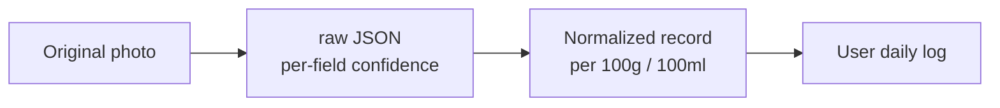
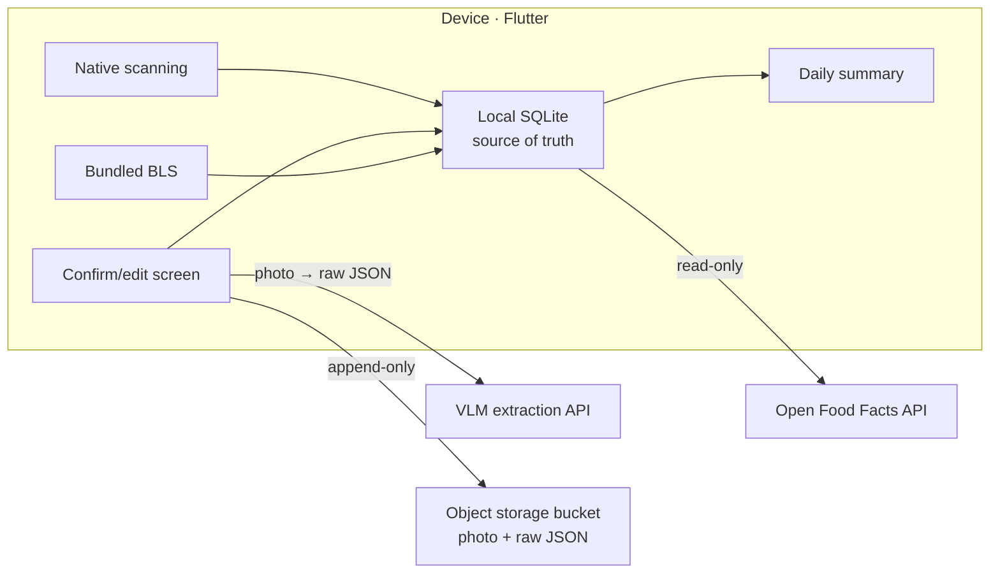
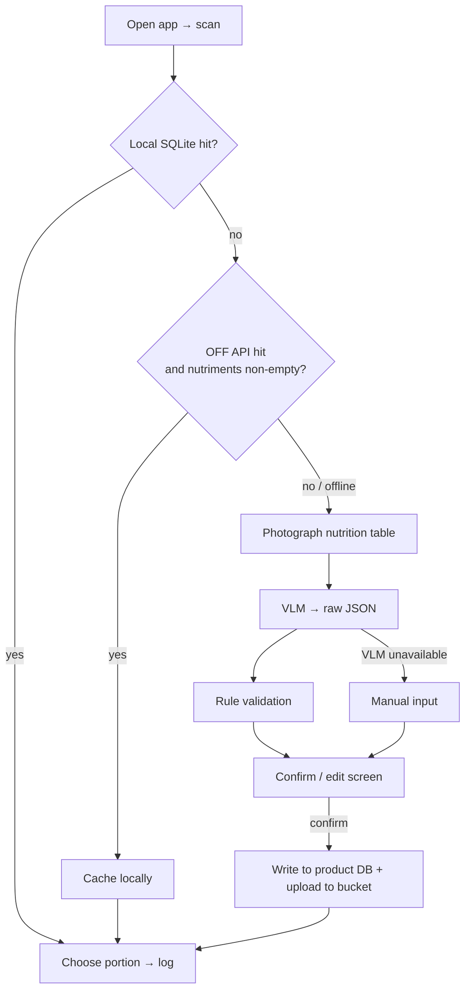

# Personal Food Nutrient Database App — PRD

2026-09-18 · Hannes

> Language: English (translation) · [中文（主版本）](./PRD.md). The Chinese version is canonical; update both in the same PR.

> Revision history
> - 2026-09-26: Switched the vision model from the Gemini Flash free tier to Claude.
> - 2026-09-26: Now a two-person collaboration, with a first external milestone of a demo on 2026-10-14; added `manual` to provenance; EU inference requires a server-side proxy (D17); model IDs and prices are now defined once in `schema/eval/models.yaml`. See [DEV_PLAN](./DEV_PLAN.en.md) for tasks and schedule, and [docs/decisions/](./decisions/) for decision records.
> - 2026-09-26: Package name set to `de.belvast.nutriscan`; the demo uses Android first, iOS follows; Haiku 4.5 dropped from the VLM candidates; the collaborating developer counts as the second real user, so the cloud-sync trigger is met.
> - 2026-09-26: Development runs on Claude subscriptions (Claude Code) with no API access for now; the API is decided after the 10/14 demo, depending on Startup credits (D21).
> - 2026-09-26: The code license for the MVP phase is MIT (D16).
> - 2026-09-26: Work split set: Track A Hannes, Track B mica; the API is now prepaid through Hannes's Startup account (D21); CI conventions (D22); no external code contributions during the MVP phase; the application to attend the demo event is pending.
> - 2026-10-08: Sonnet 5 (now legacy) replaced by Sonnet 5.5 among the evaluation candidates (ADR 0026).

## 1. Product overview

An offline-first personal food logging app: if a barcode scan hits, the item is logged immediately; on a miss, the user photographs the nutrition facts table, a VLM extracts it, and the user confirms before it is stored. As a side effect it builds up a nutrition database that can later be opened up. This document consolidates every decision from the discussions on 2026-09-11 and 2026-09-12 and serves as development context for AI tools such as Claude Code.

**Background and pain point**: The food databases of existing tools (FatSecret, etc.) often miss local German products and Asian products, and a miss means typing the values in by hand from the package. Image recognition itself is a solved problem; the real differentiator is **bringing the cost of logging close to zero**, not "building yet another, bigger open nutrition database".

**Target users**: In the MVP phase, the two developers of EatWell Studio themselves (Hannes, Karlsruhe, Germany, shopping mainly at Rewe / Lidl / Kaufland / Alnatura; and the collaborating developer). The appearance of a second real user is one of the triggers for introducing cloud sync: the collaborating developer counts as the second real user (D19), so this trigger is met; when Phase 3 starts is decided separately (see DEV_PLAN 7.2).

**Core goals**

1. Logging an item takes almost no time: scan hit → one-step log; miss → photo → confirm → log
2. The main flow still works in a supermarket basement with no signal
3. Every user-confirmed extraction result (photo + raw JSON + normalized record) is never lost, is traceable, and can be re-run
4. Data carries source attribution from day one, so it can later be opened up or licensed cleanly

**Non-goals (explicitly not in the MVP)**

- Accounts, cross-device sync, shared database
- Meal planning, calendar reminder integration, social features, contributor incentives
- Business model design
- Recognizing barcodes with AI (use native scanning)
- Preloading a full or trimmed OFF dump

**How it is built**: A two-person collaboration (public repository, monorepo), on weekends plus weekday evenings, written mainly with Claude Code. Collaboration rules are in [CONTRIBUTING.md](../CONTRIBUTING.md) and [CLAUDE.md](../CLAUDE.md). First external milestone: a live demo at Claude Founder House Stockholm on 2026-10-14 (attendance application pending; development still targets this date).

## 2. Core requirements and feature list

The MVP has only four features, listed by priority; F3 has higher priority than the daily summary page.

| ID | Feature | Description | Priority |
| --- | --- | --- | --- |
| F1 | Scan to log | Native scanning (ML Kit / AVFoundation) → look up local SQLite → on miss, query the OFF API → on hit, write to today's log in one step and cache the product locally forever | P0 |
| F2 | Photo extraction + confirmation | Miss → photograph the nutrition facts table → VLM returns JSON with confidence values → rule validation → confirm/edit screen → store and log | P0 |
| F3 | Raw data export | For every confirmed record, upload the photo and raw JSON as-is to an append-only object storage bucket; queue locally when offline and upload on the next connection | P0 |
| F4 | Daily intake summary | Daily totals of energy and main nutrients | P1 |
| F5 | Basic ingredient lookup | Loose ingredients without barcodes and home-cooked meals: look up the locally bundled BLS | P1 |

**F1 lookup order**: local SQLite → OFF API → photo. An OFF entry that only has photos and a name, with empty `nutriments`, counts as a miss and goes to F2.

**The F2 confirm/edit screen is the most important screen in the app.** It addresses three things at once: data quality, user trust, and the error-feedback loop. Requirements:

- Show extracted values field by field; highlight fields with low confidence or failed validation and require explicit user confirmation
- Show the original reference quantity (per 100g / per serving / custom serving text) and the normalized per-100g values
- The user can edit any field; validation re-runs after each edit
- Nothing is written to the product database before the user confirms

**Rule validation (built into F2, nearly zero cost)**

- Atwater: protein×4 + carbohydrate×4 + fat×9 deviates from the declared energy by > 15% → flag as suspicious
- Mass conservation: the sum of all nutrient masses ≤ 100 g
- Main target: VLM misreads such as reading 12 as 1.2

**Graceful degradation**: If any external dependency goes down, the main flow must not stop. OFF down → fall back to photo; VLM down → fall back to manual input; bucket down → queue locally.

## 3. Data model and data sources

Store three layers and never collapse them into one; copy existing standards for the schema instead of designing our own; every record carries provenance from day one.

**Three-layer storage (traceable, re-runnable)**



When switching models later, re-run the photos to get new raw JSON, then normalize again; none of the three layers may be deleted.

**Normalization rules (the real engineering work, harder than the image recognition)**

- Store normalized per-100g / per-100ml values, **while keeping the original reference quantity definition** (per serving, free-text serving size such as "1 cup (240ml)", "about 3 pieces")
- Unit handling: keep kcal and kJ side by side; sodium ↔ salt (salt = sodium × 2.5); distinguish total sugars from added sugars; mark whether dietary fibre is counted in carbohydrates according to the source's regulation
- German label specifics: per-100g layout, kJ/kcal side by side, indented sub-items "davon Zucker" / "davon gesättigte Fettsäuren"

**Core entities**: Product (barcode, brand, name) → Nutrient record (versioned; one product can have several sources / versions) → User log entry (time, portion, linked nutrient record version). Nutrient field naming follows the EuroFIR standard codes (the set BLS uses), with mapping tables to OFF field names and USDA nutrient IDs.

**Data sources (three tiers)**

| Tier | Source | License | Access | Notes |
| --- | --- | --- | --- | --- |
| Barcoded products | [Open Food Facts](https://world.openfoodfacts.org/data) API | ODbL (share-alike) | Live API, each call corresponds to one real scan; hits cached permanently in local SQLite | The terms explicitly allow this use; do not scrape the database through the API. The full dump is about 43 GB JSONL / 6.2 GB Parquet; the MVP does not touch it |
| Basic ingredients / dishes | [BLS 4.0](https://blsdb.de/download) (Bundeslebensmittelschlüssel, Max Rubner-Institut) | CC BY 4.0, attribution to MRI required | Bundled with the app | About 7,140 foods and 138 nutrients, EuroFIR codes, freely available since 2025-12; the institute is right here in Karlsruhe |
| Alternative basic ingredients | USDA FoodData Central Foundation Foods | Public domain | Optional bundle, about 29 MB | Lower priority than BLS; Branded Foods (about 2.9 GB) only covers the US / Canada / New Zealand and is useless for Germany |
| Neither has it | Photo + VLM extraction | Own data | See section 4 | This is where the product's real differentiation lies |

**Provenance field (cannot be postponed)**: Every nutrient record must state which source it derives from — `off` / `bls` / `usda` / `vlm_user` / `manual` (manual user input, no VLM extraction) — plus the source version and time. The licenses differ in how "viral" they are; once mixed, they can never be separated again. When opening up the data or licensing it B2B later, this field is what keeps them apart.

**The local database grows; it is not preloaded**: People's diets are highly repetitive. After a few dozen scans, all regularly bought products are local, which is how offline availability is achieved — no preloaded dump needed.

## 4. Technical architecture and stack decisions

The MVP has no server-side state to maintain: the Flutter app + local SQLite is the source of truth, connected to only three external services, two of them read-only.



There is deliberately no line between the bucket and SQLite: the bucket is not a backup but the raw log of extraction results — append-only, never queried, not part of sync.

**Stack decisions**

| Layer | Choice | Rationale / rejected alternatives |
| --- | --- | --- |
| Client | Flutter | Cross-platform, can ship to both stores, mature camera and scanning ecosystem. Rejected native (weekend project; shipping to both platforms matters more than performance) and PWA (awkward API access) |
| Barcode | ML Kit (Android) / AVFoundation (iOS) | Fast, accurate, free; no AI |
| Local storage | SQLite | Source of truth; whatever runs remotely is only a sync target |
| Image recognition | Claude (Anthropic Messages API); a single call uses [structured outputs](https://platform.claude.com/docs/en/build-with-claude/structured-outputs) (`output_config.format` + JSON Schema) to return JSON directly. Candidate models: Opus 5.5 ([the officially recommended default starting point](https://platform.claude.com/docs/en/models/overview)), Sonnet 5.5; decided after the Phase 0.5 evaluation (ADR 0002, ADR 0026). **Model IDs, prices and image limits are defined only in `schema/eval/models.yaml`**; this document does not state concrete numbers | Alternative: Mistral La Plateforme (Pixtral, EU data residency), only in the evaluation script, third-choice fallback for the EU route. Rejected Groq (text-first) and OpenRouter `:free` (best-effort, rate-limited, model list changes often). The Claude API has no free tier and bills per token; under Anthropic's commercial terms, API inputs and outputs are [not used for training by default](https://privacy.claude.com/en/articles/7996868-is-my-data-used-for-model-training). Anthropic has no official Dart SDK, so the app calls HTTP directly; the batch layer uses the official Python SDK, and re-running history can go through Message Batches (half price). Claude subscriptions (Pro / Max) [do not include API usage](https://support.claude.com/en/articles/9876003-i-have-a-paid-claude-subscription-pro-max-team-or-enterprise-plans-why-do-i-have-to-pay-separately-to-use-the-claude-api-and-console); the API credit for evaluation and in-app extraction is prepaid through Hannes's Startup account (D21) |
| Raw data export | Own object storage bucket (not inside Supabase), append-only; object keys start with `<barcode>_<timestamp>` (the rule for products without a barcode, versions of confirmed results, etc. are in ADR 0012) | The only non-reproducible asset; about twenty lines of code; does not need to move in any future migration |
| Cloud (once triggered) | Supabase, EU region (Frankfurt) | Managed Postgres + Auth + RLS + Storage + full-text search. Rejected Firebase: nutrition data is strongly relational, needs fuzzy search, and a shared database is read-heavy while Firebase bills per read |
| Batch processing (once triggered) | FastAPI + Python | Sits **below** the database for batch work (read the bucket, re-run the VLM, write normalized results back); it is not an API layer between the app and the database |

**Three triggers for introducing Supabase** (adopt it as soon as any one occurs): wanting to view the data on a computer or keep using it on a new phone; a second real user appears; server-side batch processing is needed (e.g. re-running history with a new model).

**Supabase usage constraints (keeping the door open for migration)**

- All Supabase access goes through a single data access layer on the Dart side
- No business logic in Edge Functions, RLS policies or triggers; treat it as plain Postgres
- When reads scale up later, first put a read-only API + CDN in front and provide daily dumps, rather than switching databases (this is what OFF does)

**Both VLM call paths share the same prompt and output schema**: live on-device calls and batch-layer re-runs must produce the same structure, otherwise re-run data will not line up. Batch processing needs resumable runs and the ability to re-run only a subset (e.g. only the batch that failed Atwater validation).

**Self-hosted alternative**: Small specialized document models (PaddleOCR-VL-1.6, 0.9B, about 1 GB in INT8) already beat large VLMs on OmniDocBench. The route is two-stage: OCR extracts the table structure → a small text model or rules map it to the schema. Evaluate this when cost or privacy starts to matter, and check the model weights' license first.

## 5. User flow and screen requirements

There is only one main flow: two steps on a hit, four steps on a miss; the user never needs to search manually.



**Screen list (4 screens in the MVP)**

| Screen | Content | Key requirements |
| --- | --- | --- |
| Scan | Full-screen viewfinder, scanning starts on open | Feedback within 1 second of a hit; never blocks when offline |
| Confirm/edit | Field-by-field list of extraction results + original image thumbnail | Suspicious fields highlighted and must be confirmed one by one; shows original reference quantity and normalized values; validation re-runs immediately after edits |
| Portion logging | Choose portion (g / ml / serving) and time | Defaults to the portion last logged for this product |
| Daily summary | Totals of energy and main nutrients, list of entries | Entries can be deleted or edited |

**Confirm/edit screen details**

- Field order is fixed to the German label order: energy (kJ / kcal), fat, of which saturates, carbohydrate, of which sugars, protein, salt; other nutrients collapsed
- Low-confidence fields and failed-validation fields share the same visual treatment and state the reason (e.g. "Atwater deviation 23%")
- The user cannot skip highlighted fields and confirm directly
- The whole extraction result can be marked as "unreadable", switching to manual input

**Offline state**: No prominent online/offline indicator; only when a network step (OFF lookup, VLM) fails, show a one-line notice and degrade gracefully. The bucket upload queue status lives on the settings page and does not disturb the main flow.

## 6. Non-functional requirements

Offline availability is a hard constraint; everything else can be added later.

| Category | Requirement |
| --- | --- |
| Offline | Scanning, local hits, logging and the summary work fully without a network; photos can be stored locally first and extracted once online. Remote services may only be sync targets, never a precondition of the main flow |
| Data safety | Confirmed photos (the original image and the derived image sent to the model) and raw JSON must exist both locally and in the bucket; the bucket is append-only and no code path may delete or overwrite bucket objects |
| Traceability | Every normalized record can be traced to its raw JSON, original photo, the hash of the image sent to the model, the model name, effort and prompt version |
| Privacy | Photos may show hands, tables, kitchens; all photos have EXIF (including GPS) stripped. Under its commercial terms the Claude API does not train on data by default, which is acceptable while only the two developers use the app during the MVP. **The Claude API does not support in-EU inference**: `inference_geo` only has the values `global` and `us` ([data residency docs](https://platform.claude.com/docs/en/manage-claude/data-residency)). Only two EU routes remain: the Google Vertex AI EU multi-region (Opus 5.5 is available there and supports structured outputs, which an admin must enable in the organization policy; whether Sonnet 5.5 is available there is not yet verified (ADR 0026); [Claude on Vertex AI](https://platform.claude.com/docs/en/build-with-claude/claude-on-vertex-ai)), and Amazon Bedrock EU cross-region inference (Opus 5.5 / Sonnet 5.5 on Bedrock do not support structured outputs; see the structured outputs docs). Both require cloud-platform credentials held on a server, so **before any user other than the developers, the server-side proxy milestone (D17) must be complete**: VLM calls and bucket uploads go through a stateless proxy, keys never live on the client, and inference stays in the EU. Mistral is the third-choice fallback. Cloud services always use EU regions |
| License compliance | Every record carries provenance; external output can be filtered by source; wherever BLS data is shown, attribute the Max Rubner-Institut |
| OFF terms of use | 1 API call = 1 real scan; never bulk-scrape; cache hits to reduce repeated calls |
| Performance | Local hit feedback < 1 second; the VLM round trip is bounded by a third party, so the UI needs a clear waiting state and must allow cancelling |
| Internationalization | UI languages are Chinese and English, both shipped together (D2); label language supports German first; the schema itself is language-agnostic |
| Platforms | Android and iOS from one codebase; the MVP only needs to run on the developers' own devices; store release is out of MVP scope. The 2026-10-14 demo uses Android first; the iOS version follows (D20) |

## 7. Development phases and milestones

Phase 0 is validation with no app code; Phase 1 is the MVP, built by two people, with the 2026-10-14 demo as an intermediate milestone; see DEV_PLAN for the schedule.

| Phase | Content | Done when |
| --- | --- | --- |
| 0 · Validation | Collect 30+ barcodes of regularly bought German products from shopping receipts (including Rewe / Lidl / Alnatura own brands), query `https://world.openfoodfacts.org/api/v2/product/<barcode>` directly and measure the share with complete `nutriments`; download the BLS zip and look at nutrient codes, reference quantities and how dishes are distinguished from ingredients; photograph 30+ nutrition tables to build an evaluation set (supermarket or products already at home are both fine) and transcribe the ground truth by hand | There is a hit-rate number, a BLS field note, and an evaluation set directory |
| 0.5 · Model selection | Run the Claude candidate models (Opus 5.5 / Sonnet 5.5, plus Fable 5.1 as an accuracy upper-bound reference) and Mistral on the evaluation set. Metrics: Atwater failure rate, per-field accuracy, silent error rate, P50 / P90 latency, cost per call. Selection criteria in order: silent error rate → P90 ≤ 25 s → cost | MVP model and effort chosen; evaluation script lives in `schema/` as a regression test |
| 1 · MVP | F1 scan to log → F2 photo extraction + confirmation → F3 bucket export → F4 daily summary; all on local SQLite. Intermediate milestone: 2026-10-14 demo (scope in DEV_PLAN 4.2) | Used for a week straight; everyday products mostly hit locally |
| 2 · Ingredient layer | F5: bundle BLS, support ingredients without barcodes and home-cooked meals | Can log a home-cooked meal |
| 3 · Cloud sync (once triggered) | Trigger met (D19); start date TBD. Supabase EU + Dart data access layer + accounts; SQLite remains the local source of truth | Data survives switching phones |
| 4 · Batch processing (once triggered) | FastAPI reads the bucket, re-runs, writes normalized results back; OFF dump pipeline with quarterly full import + daily deltas | One click re-runs all history with a new model |
| 5 · Opening up | **Precondition: the server-side proxy milestone (D17) is complete.** Read-only API + CDN + daily dumps; output filtered by provenance | First third-party consumer |

**The evaluation set is worth more than any single model choice**: models and prices change every quarter, the evaluation set does not, and it becomes the regression test whenever the model changes.

**OFF dump pipeline (Phase 4 only; the app never touches dumps directly)**: Download the full dump quarterly; on the server, read only the needed columns with Parquet + DuckDB, filter and normalize, and produce a trimmed SQLite published to a CDN by version; pull daily deltas to keep up. Deltas contain no deletions, so the quarterly full import cannot be skipped, otherwise ghost products accumulate.

## 8. Conventions for AI-assisted development

One repo; `schema/` is the single physical location of the nutrient definitions, prompts and output JSON structure, from which both Dart and Python are generated.

**Directory structure**

```
app/        Flutter client
api/        FastAPI batch layer (empty or skeleton only before Phase 4)
supabase/   migrations, RLS, seed (from Phase 3)
schema/     nutrient field definitions, VLM prompts, output JSON schema, codegen, evaluation set and scripts
docs/       this PRD, architecture diagrams, decision records
```

**Rules AI tools must follow in this project**

1. Never add a second nutrient field definition. Every field change goes into `schema/` first, then codegen is re-run; hand-writing duplicate types in Dart or Python is forbidden
2. Prompts and output JSON structures in `schema/` are versioned; raw JSON records must store the version used
3. None of the three data layers (photo / raw JSON / normalized record) may have a delete code path; the bucket is append-only
4. Every nutrient table must have a non-null `provenance` column, validated on write
5. The main flow (scan → log) must not depend on the network; every network call needs a timeout and a degradation branch
6. Barcode recognition uses only ML Kit / AVFoundation, never an AI API
7. Business logic lives only in the Dart data access layer or `api/`, never in Supabase Edge Functions, RLS or triggers
8. Before changing the VLM prompt or switching models, run the evaluation script in `schema/`; the Atwater failure rate must not go up
9. CI uses path filters: only changes to `app/**` run the Flutter build, only changes to `api/**` run pytest; changes to `schema/**` run both
10. License information for external data sources (OFF ODbL, BLS CC BY 4.0, USDA public domain) is written in `docs/` and referenced in code comments; never mix them up

**Coding conventions**

- Dart: official `flutter_lints`; database access only through one repository layer; the UI never touches SQLite directly
- Python: Pydantic v2 models as the schema source; `ruff` + `pytest`
- Numbers are stored as decimals, with the unit made explicit as a field-name suffix (`energy_kcal`, `sodium_mg`, `salt_g`); no bare numbers
- Commit messages state the layer changed: `app:`, `api:`, `schema:`, `docs:`, `ci:`, and `chore:` for repository-level housekeeping; the body must include `Refs:` with the task ID (D22)

**Collaboration**: Branches, PRs, review and merge method are described in [CONTRIBUTING.md](../CONTRIBUTING.md); Claude Code session rules are in [CLAUDE.md](../CLAUDE.md). Model IDs and prices are defined only once, in `schema/eval/models.yaml`.

**MVP acceptance criteria**

- [ ] With no network, scan an already cached product and log it, with no errors and no waiting
- [ ] Scan a German product not in OFF; within 30 seconds of taking the photo the confirm screen appears, with suspicious fields highlighted
- [ ] After manually changing 12 to 1.2, the Atwater check immediately turns red
- [ ] The confirmed photo and raw JSON appear in the bucket, with file names containing the barcode and timestamp
- [ ] Scanning the same product a second time hits locally
- [ ] The daily summary's energy equals the sum of all entries scaled by portion
- [ ] Every nutrient record in the database has a non-null `provenance`
- [ ] The evaluation script runs with a single command and outputs each model's Atwater failure rate

## 9. Open questions and future extensions

The following items were not settled in discussion, or are Claude's suggestions that have not yet been verified; they need to be decided before coding starts.

**Open decisions**

See [DEV_PLAN section 1](./DEV_PLAN.en.md) for the mapping between decision IDs and ADRs.

- [x] App name and package name: `NutriScan`, `de.belvast.nutriscan` (D1)
- [x] UI language: Chinese and English at the same time (D2)
- [x] Object storage bucket: Backblaze B2 EU Central (D3, pending confirmation by the P0-6 hands-on test)
- [x] Nutrient field naming: internal keys are snake_case with unit suffixes, with EuroFIR / OFF / USDA as mappings (D4)
- [ ] Phase 0 OFF hit-rate result (D5: thresholds unchanged, sample of 30+ barcodes)
- [x] Do not bundle USDA Foundation Foods (D6)
- [x] Have someone assess the impact of ODbL share-alike before store release (D7)
- [ ] Which Claude model to use for the VLM: decided after the Phase 0.5 evaluation (D14)
- [x] Mistral only in the evaluation script; not implemented in the app before the demo (D15)
- [x] Code license and contribution terms: MIT during the MVP phase, no DCO or CLA (D16); the code is jointly owned by the two members of EatWell Studio (D18)
- [x] The collaborating developer counts as the second real user (D19)
- [ ] When Phase 3 (cloud sync) starts
- [x] Demo platform: Android first, iOS afterwards (D20)
- [x] API credit before the demo: development runs on Claude subscriptions; the API credit for in-app extraction and evaluation is prepaid through Hannes's Startup account (D21)

**Explicitly postponed directions** (ideas exist from the discussions, but not in the MVP)

| Direction | Idea | When |
| --- | --- | --- |
| Meal planning + reminders | Create reminders through the Google / Apple Calendar APIs, keeping business logic and data in our own backend | Once logging is stable |
| Contributor incentives | Not designed; uploading is a side effect of logging and accumulates naturally if the flow is fast | Revisit once DAU scales |
| Business model | Factual data is not a moat; possible outlets are consumer logging/planning subscriptions or B2B API and data licensing | Once coverage is valuable |
| Splitting the repo | Split when the data + API and the consumer app differ in audience, release cadence and license (`git filter-repo`, half an hour) | Opening-up phase |
| Self-hosted Postgres | Only migrate if managed tiers are insufficient or a compliance contract strictly requires it; the more likely path is a read-only API + CDN in front of Supabase | Once reads scale up |
| Self-hosted OCR | Two-stage approach with small PaddleOCR-VL-class models | When cost or privacy matters |

**Sources**

- [Open Food Facts data downloads and API terms](https://world.openfoodfacts.org/data)
- [Reusing Open Food Facts Data](https://wiki.openfoodfacts.org/Reusing_Open_Food_Facts_Data)
- [BLS 4.0 download page (Max Rubner-Institut)](https://blsdb.de/download)
- [USDA FoodData Central downloads](https://fdc.nal.usda.gov/download-datasets)
- [Claude models overview](https://platform.claude.com/docs/en/models/overview), [pricing](https://platform.claude.com/docs/en/about-claude/pricing)
- [Claude structured outputs](https://platform.claude.com/docs/en/build-with-claude/structured-outputs)
- [Claude vision](https://platform.claude.com/docs/en/build-with-claude/vision), [effort](https://platform.claude.com/docs/en/build-with-claude/effort)
- [Claude API data residency](https://platform.claude.com/docs/en/manage-claude/data-residency)
- [Claude on Vertex AI](https://platform.claude.com/docs/en/build-with-claude/claude-on-vertex-ai), [Claude on Amazon Bedrock](https://platform.claude.com/docs/en/build-with-claude/claude-in-amazon-bedrock)
- [Anthropic: is API data used for training?](https://privacy.claude.com/en/articles/7996868-is-my-data-used-for-model-training)
- In-project discussions: 2026-09-11 app features and tech stack; 2026-09-12 architecture design
