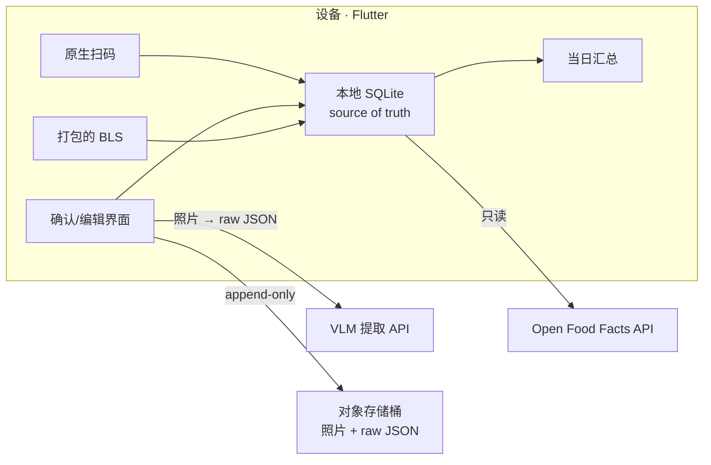
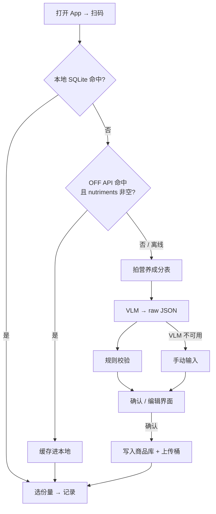

# 个人食物营养素数据库 APP — PRD

2026-09-18 · Hannes

> 语言：中文（主版本）· [English](./PRD.en.md)。改动须在同一个 PR 里同步两个版本。

> 修订记录
> - 2026-09-26：识图模型由 Gemini Flash 免费层改为 Claude。
> - 2026-09-26：改为两人协作，首个外部里程碑为 2026-10-14 演示；provenance 增加 `manual`；EU 境内推理需要服务端代理（D17）；型号 ID 与价格改由 `schema/eval/models.yaml` 统一定义。任务与排期见 [DEV_PLAN](./DEV_PLAN.md)，决策记录见 [docs/decisions/](./decisions/)。
> - 2026-09-26：包名定为 `de.belvast.nutriscan`；演示先用 Android，iOS 随后补齐；Haiku 4.5 移出 VLM 候选；协作开发者计为第二个真实用户，云同步的触发条件已满足。
> - 2026-09-26：开发期用 Claude 订阅（Claude Code），暂不开通 API；API 在 10/14 演示后视 Startup credits 再定（D21）。
> - 2026-09-26：MVP 阶段代码许可证定为 MIT（D16）。
> - 2026-09-26：分工定为线 A Hannes、线 B mica；API 改由 Hannes 的 Startup 账号预付（D21）；CI 规约（D22）；MVP 阶段不接受外部代码贡献；演示活动的参加申请待批准。
> - 2026-10-08：评测候选里的 Sonnet 5（已是 legacy）换成 Sonnet 5.5（ADR 0026）。

## 1. 产品概述

一个 offline-first 的个人饮食记录 App：扫码命中即记录，未命中拍营养成分表由 VLM 提取、用户确认后入库，顺带沉淀一份可开放的营养数据库。本文档整合了 2026-09-11 和 2026-09-12 两次讨论的全部决策，供 Claude Code 等 AI 工具作为开发上下文使用。

**背景与痛点**：现有工具（FatSecret 等）的食品库经常查不到德国本地商品和亚洲商品，查不到就要对着包装手动录入。识图本身已是解决了的问题，真正的差异点是**把录入成本降到接近零**，而不是"再做一个更大的开放营养库"。

**目标用户**：MVP 阶段是 EatWell Studio 的两位开发者本人（Hannes，德国卡尔斯鲁厄，主要在 Rewe / Lidl / Kaufland / Alnatura 购物；以及协作开发者）。第二个真实用户出现是引入云同步的触发条件之一：协作开发者计为第二个真实用户（D19），因此该条件已满足，阶段 3 何时启动另行决定（见 DEV_PLAN 7.2）。

**核心目标**

1. 记录一件商品的耗时接近零：扫码命中 → 一步记录；未命中 → 拍照 → 确认 → 记录
2. 在超市地下层无信号时主流程依然可用
3. 每一条经用户确认的提取结果（照片 + raw JSON + 归一化记录）永不丢失、可回溯、可重跑
4. 数据从第一天起带来源标注，将来能干净地对外开放或授权

**非目标（MVP 明确不做）**

- 账号体系、跨设备同步、共享库
- 饮食规划、日历提醒集成、社交、贡献者激励机制
- 盈利模式设计
- 用 AI 识别条码（用原生扫码）
- 预装 OFF 全量或裁剪 dump

**开发方式**：两人协作（公开仓库、单仓库），周末加工作日晚上，主要用 Claude Code 编写。协作规则见 [CONTRIBUTING.md](../CONTRIBUTING.md) 与 [CLAUDE.md](../CLAUDE.md)。首个外部里程碑：2026-10-14 在 Claude Founder House Stockholm 现场演示（参加申请待批准；开发进度仍以该日期为目标）。

## 2. 核心需求与功能列表

MVP 只有四个功能，按优先级排列；F3 的优先级高于当日汇总页。

| 编号 | 功能 | 说明 | 优先级 |
| --- | --- | --- | --- |
| F1 | 扫码记录 | 原生扫码（ML Kit / AVFoundation）→ 查本地 SQLite → 未命中查 OFF API → 命中则一步写入当日记录，并把商品永久缓存到本地 | P0 |
| F2 | 拍照提取 + 确认 | 未命中 → 拍营养成分表 → VLM 返回带置信度的 JSON → 规则校验 → 确认/编辑界面 → 存库并记录 | P0 |
| F3 | 原始数据出口 | 每条确认过的记录，把照片和 raw JSON 原样上传到 append-only 对象存储桶；离线时本地排队，下次联网补传 | P0 |
| F4 | 当日摄入汇总 | 按天汇总热量与主要营养素 | P1 |
| F5 | 基础食材查询 | 无条码的散装食材、自己做的饭：查本地打包的 BLS | P1 |

**F1 查找顺序**：本地 SQLite → OFF API → 拍照。OFF 条目只有照片和名字、`nutriments` 为空的情况算未命中，走 F2。

**F2 确认/编辑界面是整个 App 最重要的一屏**，同时解决数据质量、用户信任和错误反馈闭环三件事。要求：

- 逐字段展示提取值，置信度低或校验失败的字段高亮，要求用户明确确认
- 显示原始参考量（per 100g / per serving / 自定义 serving 文本）和归一化后的 per-100g 值
- 用户可以修改任意字段；修改后重新跑校验
- 用户确认前不写入商品库

**规则校验（F2 内置，成本几乎为零）**

- Atwater：蛋白质×4 + 碳水×4 + 脂肪×9 与标示热量偏差 > 15% → 标为可疑
- 质量守恒：所有营养素质量之和 ≤ 100 g
- 主要拦截目标：12 读成 1.2 这类 VLM 误读

**降级行为**：任何外部依赖掉线，主流程都不能停。OFF 挂了退化成拍照；VLM 挂了退化成手动输入；桶挂了本地排队。

## 3. 数据模型与数据来源

存三层、不压成一层；schema 抄现成标准，不自己设计；每条记录从第一天起带 provenance。

**三层存储（可回溯、可重跑）**


将来换模型时，用照片重跑得到新的 raw JSON，再重新归一化；三层都不能删。

**归一化规则（真正的工程量，比识图难）**

- 库里存归一化后的 per-100g / per-100ml，**同时保留原始参考量定义**（per serving、serving size 自由文本如 "1 cup (240ml)"、"约 3 块"）
- 单位统一：kcal 与 kJ 并存；钠 ↔ 盐（盐 = 钠 × 2.5）；区分总糖与添加糖；膳食纤维是否计入碳水按来源法规标注
- 德式标签特点：per 100g 排版、kJ/kcal 并列、"davon Zucker" / "davon gesättigte Fettsäuren" 缩进子项

**核心实体**：商品（barcode、品牌、名称）→ 营养素记录（版本化，一个商品可有多个来源/多个版本）→ 用户记录（时间、份量、关联的营养素记录版本）。营养素字段命名采用 EuroFIR 标准代码（BLS 用的那套），并保留到 OFF 字段名和 USDA nutrient ID 的映射表。

**数据来源（三层）**

| 层 | 来源 | 许可 | 接入方式 | 备注 |
| --- | --- | --- | --- | --- |
| 条码商品 | [Open Food Facts](https://world.openfoodfacts.org/data) API | ODbL（share-alike） | 实时 API，每次调用对应一次真实扫码；命中结果永久缓存进本地 SQLite | 条款明确允许此用法；不要用 API 爬库。全量 dump 约 43 GB JSONL / 6.2 GB Parquet，MVP 不碰 |
| 基础食材 / 菜品 | [BLS 4.0](https://blsdb.de/download)（Bundeslebensmittelschlüssel，Max Rubner-Institut） | CC BY 4.0，需署名 MRI | 打包进 App | 约 7 140 种食品、138 种营养素，EuroFIR 代码，2025-12 起免费开放；机构就在卡尔斯鲁厄 |
| 备选基础食材 | USDA FoodData Central Foundation Foods | 公有领域 | 可选打包，约 29 MB | 优先级低于 BLS；Branded Foods（约 2.9 GB）只覆盖美/加/新西兰，对德国无用 |
| 两者都没有 | 拍照 + VLM 提取 | 自有 | 见第 4 节 | 这是产品真正的差异点所在 |

**provenance 字段（不可延后）**：每条营养素记录必须标明派生自 `off` / `bls` / `usda` / `vlm_user` / `manual`（用户手动输入，没有 VLM 提取）中的哪一个，以及来源版本与时间。三种许可传染性不同，混过一次就分不开，将来对外开放或 B2B 授权时靠这个字段区分。

**本地库是长出来的，不是预装的**：人的饮食重复率极高，几十次扫码之后常买商品全在本地，离线可用由此实现，不需要预置 dump。

## 4. 技术架构与技术栈决策

MVP 没有任何需要维护的服务端状态：Flutter App + 本地 SQLite 作为权威，只连三个外部服务，其中两个只读。



桶和 SQLite 之间没有连线是有意的：桶不是备份，是提取结果的原始流水，只 append、不查询、不参与同步。

**技术栈决策**

| 层 | 选择 | 理由 / 被否决项 |
| --- | --- | --- |
| 客户端 | Flutter | 跨平台、能上架双商店、相机与扫码生态成熟。否决原生（周末项目，上架两平台的收益大于性能）和 PWA（接 API 费劲） |
| 条码 | ML Kit（Android）/ AVFoundation（iOS） | 快、准、免费；不用 AI |
| 本地存储 | SQLite | 权威数据源；远端无论用什么都只是同步目标 |
| 识图 | Claude（Anthropic Messages API），一次调用用[结构化输出](https://platform.claude.com/docs/en/build-with-claude/structured-outputs)（`output_config.format` + JSON Schema）直接返回 JSON。候选型号：Opus 5.5（[官方推荐的默认起点](https://platform.claude.com/docs/en/models/overview)）、Sonnet 5.5，阶段 0.5 评测后拍板（ADR 0002、ADR 0026）。**型号 ID、价格、图片上限只在 `schema/eval/models.yaml` 定义**，本文不写具体数字 | 备选：Mistral La Plateforme（Pixtral，EU 数据驻留），只进评测脚本，是 EU 路线的第三顺位退路。否决 Groq（文本优先）和 OpenRouter `:free`（best-effort、限流、名单常换）。Claude API 无免费层，按 token 计费；按 Anthropic 商业条款，API 的输入输出[默认不用于训练](https://privacy.claude.com/en/articles/7996868-is-my-data-used-for-model-training)。Anthropic 没有官方 Dart SDK，App 端直接调 HTTP；批处理层用官方 Python SDK，重跑历史可以走 Message Batches（半价）。Claude 订阅（Pro / Max）[不包含 API 额度](https://support.claude.com/en/articles/9876003-i-have-a-paid-claude-subscription-pro-max-team-or-enterprise-plans-why-do-i-have-to-pay-separately-to-use-the-claude-api-and-console)；评测与 App 内提取所需的 API 额度由 Hannes 的 Startup 账号预付（D21） |
| 原始数据出口 | 自有对象存储桶（不在 Supabase 内），append-only，对象键以 `<barcode>_<timestamp>` 开头（无条码时的替代规则、确认结果的版本等见 ADR 0012） | 唯一不可再生的资产；约二十行代码；将来迁移时它不用动 |
| 云端（触发后） | Supabase，EU 区域（Frankfurt） | 托管 Postgres + Auth + RLS + Storage + 全文搜索。否决 Firebase：营养数据强关系型、需要模糊搜索、共享库读密集按读计费 |
| 批处理（触发后） | FastAPI + Python | 位置在数据库**下方**做批处理（读桶、重跑 VLM、归一化写回），不是 App 与数据库之间的 API 层 |

**引入 Supabase 的三个触发条件**（任一出现即接）：想在电脑上看数据或换手机继续用；出现第二个真实用户；需要服务端批量处理（例如换模型重跑历史数据）。

**Supabase 使用约束（为迁移留门）**

- 所有 Supabase 访问收敛在 Dart 侧单一 data access 层
- 业务逻辑不写进 Edge Function、RLS policy 或 trigger；把它当普通 Postgres 用
- 将来读放大时优先在前面挂只读 API + CDN、提供按日 dump，而不是换数据库（OFF 就是这么做的）

**VLM 两条调用路径共享同一份 prompt 和输出 schema**：设备端实时调用与批处理层重跑必须得到相同结构，否则重跑出来的数据对不上。批处理需要断点续跑和只重跑子集（例如只重跑 Atwater 校验失败的那批）。

**自部署备选**：小型专用文档模型（PaddleOCR-VL-1.6，0.9B，INT8 约 1 GB）在 OmniDocBench 上已超过大 VLM；路线为两段式：OCR 出表格结构 → 小文本模型或规则映射到 schema。等在意成本或隐私时再评估，用前先核对模型权重许可。

## 5. 用户流程与界面要求

主流程只有一条，命中时两步完成，未命中时四步完成；用户永远不需要手动搜索。



**界面清单（MVP 共 4 屏）**

| 屏 | 内容 | 关键要求 |
| --- | --- | --- |
| 扫码 | 全屏取景框，默认打开即扫 | 命中后 1 秒内给出反馈；离线时不阻塞 |
| 确认/编辑 | 提取结果逐字段列表 + 原图缩略 | 可疑字段高亮并要求逐一确认；显示原始参考量与归一化值；改动后即时重跑校验 |
| 份量记录 | 选择份量（g / ml / 份）与时间 | 默认值为该商品上次记录的份量 |
| 当日汇总 | 热量与主要营养素合计，按记录列表 | 可删除或修改某条记录 |

**确认/编辑界面细则**

- 字段顺序固定为德国标签顺序：能量（kJ / kcal）、脂肪、其中饱和脂肪、碳水化合物、其中糖、蛋白质、盐；其余营养素折叠
- 低置信度字段与校验失败字段用同一视觉语言标记，标注失败原因（例如"Atwater 偏差 23%"）
- 用户不能跳过高亮字段直接确认
- 允许把整张提取结果标记为"无法识别"，转手动输入

**离线状态**：不做显眼的在线/离线指示器，只在需要网络的步骤（OFF 查询、VLM）失败时给出一句提示并降级；桶上传队列的状态放在设置页，不打扰主流程。

## 6. 非功能需求

离线可用是硬约束，其余都可以后补。

| 类别 | 要求 |
| --- | --- |
| 离线 | 扫码、本地命中、记录、汇总在无网络时完全可用；拍照可先存本地，联网后再提取。远端只能是同步目标，不能是主流程的前置条件 |
| 数据安全 | 确认过的照片（原图与送给模型的派生图）和 raw JSON 必须在本地和桶各有一份；桶为 append-only，任何代码路径不得删除或覆盖桶内对象 |
| 可回溯 | 每条归一化记录可追溯到它的 raw JSON、原始照片、送给模型的图片哈希、模型名称、effort 与 prompt 版本 |
| 隐私 | 照片里可能带有手、桌面、厨房环境；照片一律去掉 EXIF（含 GPS）。Claude API 按商业条款默认不用于训练，MVP 期间两位开发者自用可接受。**Claude API 不支持 EU 境内推理**：`inference_geo` 只有 `global` 和 `us` 两个值（[数据驻留文档](https://platform.claude.com/docs/en/manage-claude/data-residency)）。EU 路线只剩两条：Google Vertex AI 的 EU 多区域（Opus 5.5 在该区域可用并支持结构化输出（需管理员在组织策略里开启）；Sonnet 5.5 是否可用待核实（ADR 0026）；[Vertex AI 上的 Claude](https://platform.claude.com/docs/en/build-with-claude/claude-on-vertex-ai)）；Amazon Bedrock 的 EU 跨区域推理（Opus 5.5 / Sonnet 5.5 在 Bedrock 上不支持结构化输出，见结构化输出文档）。两条都要由服务端持有云平台凭证，因此**面向开发者以外的任何用户之前，必须完成服务端代理里程碑（D17）**：VLM 调用和桶上传都经无状态代理，密钥不落客户端，推理留在 EU。Mistral 是第三顺位退路。云端一律选 EU 区域 |
| 许可合规 | 每条记录带 provenance；对外输出时能按来源过滤；BLS 数据展示处署名 Max Rubner-Institut |
| OFF 使用条款 | 1 次 API 调用 = 1 次真实扫码；绝不批量抓取；命中结果缓存以减少重复调用 |
| 性能 | 本地命中反馈 < 1 秒；VLM 往返受第三方限制，界面需有明确的等待态且允许取消 |
| 国际化 | 界面语言为中文与英文，两者同时提供（D2）；标签语言先支持德文，schema 本身与语言无关 |
| 平台 | Android 与 iOS 同一代码库；MVP 只需在开发者自己的设备上跑，上架不在 MVP 范围。2026-10-14 的演示先用 Android，iOS 版本随后补齐（D20） |

## 7. 开发阶段与里程碑

第 0 阶段是验证，不写 App 代码；第 1 阶段是 MVP，两人协作，中途以 2026-10-14 的演示为里程碑，排期见 DEV_PLAN。

| 阶段 | 内容 | 完成标志 |
| --- | --- | --- |
| 0 · 验证 | 从购物小票里找 30 个以上常买的德国商品条码（含 Rewe / Lidl / Alnatura 自有品牌），直接访问 `https://world.openfoodfacts.org/api/v2/product/<barcode>`，统计 `nutriments` 填全的比例；下载 BLS zip 看营养素代码、参考量、菜品与食材的区分方式；拍 30 张以上营养成分表建评测集（超市或家中现有商品都可以），并手工录入真值 | 有一份命中率数字、一份 BLS 字段笔记、一个评测集目录 |
| 0.5 · 选模型 | 用评测集跑 Claude 候选型号（Opus 5.5 / Sonnet 5.5，另跑 Fable 5.1 作准确率上限参照）与 Mistral。指标：Atwater 失败率、逐字段准确率、静默错误率、P50 / P90 延迟、单次成本。选型标准依次为：静默错误率 → P90 ≤ 25 s → 成本 | 选定 MVP 型号与 effort，评测脚本进 `schema/` 作为回归测试 |
| 1 · MVP | F1 扫码记录 → F2 拍照提取 + 确认 → F3 桶出口 → F4 当日汇总；全部本地 SQLite。中途里程碑：2026-10-14 演示（范围见 DEV_PLAN 4.2） | 自己连续用一周，日常商品基本在本地命中 |
| 2 · 食材层 | F5：打包 BLS，支持无条码食材和自制饭菜 | 能记录一顿自己做的饭 |
| 3 · 云同步（触发后） | 触发条件已满足（D19），启动时机待定。Supabase EU + Dart data access 层 + 账号；SQLite 仍是本地权威 | 换手机后数据还在 |
| 4 · 批处理（触发后） | FastAPI 读桶重跑、归一化写回；OFF dump 季度全量 + 每日增量流程 | 能一键换模型重跑全部历史 |
| 5 · 对外开放 | **前置条件：服务端代理里程碑（D17）已完成。** 只读 API + CDN + 按日 dump；按 provenance 过滤输出 | 第一个第三方消费者 |

**评测集的价值高于任何一次模型选择**：型号与价格每季度都在变，评测集不变，换模型时它就是回归测试。

**OFF dump 流程（阶段 4 才做，App 不直接碰 dump）**：季度下载全量 dump，服务端用 Parquet + DuckDB 只读需要的列，筛选归一化后生成裁剪 SQLite 按版本放 CDN；每日拉 delta 跟进。delta 不含删除信息，所以季度全量不可省，否则会积累幽灵商品。

## 8. 给 AI 辅助开发的约定

单 repo，`schema/` 是营养素定义、prompt 和输出 JSON 结构的唯一物理位置，Dart 与 Python 都从它生成。

**目录结构**

```
app/        Flutter 客户端
api/        FastAPI 批处理层（阶段 4 前为空或只有骨架）
supabase/   migrations、RLS、seed（阶段 3 起）
schema/     营养素字段定义、VLM prompt、输出 JSON schema、codegen、评测集与评测脚本
docs/       本 PRD、架构图、决策记录
```

**AI 工具在本项目中必须遵守的规则**

1. 不新增第 2 份营养素字段定义。任何字段变更先改 `schema/`，再跑 codegen，禁止在 Dart 或 Python 里手写重复类型
2. `schema/` 里的 prompt 和输出 JSON 结构带版本号；raw JSON 记录必须写入使用的版本
3. 三层数据（照片 / raw JSON / 归一化记录）任何一层都不允许有删除代码路径；桶只 append
4. 每张营养素表必须有 `provenance` 列且非空；写入时校验
5. 主流程（扫码 → 记录）不得依赖网络；任何网络调用都要有超时和降级分支
6. 条码识别只用 ML Kit / AVFoundation，不调用任何 AI 接口
7. 业务逻辑只放在 Dart data access 层或 `api/`，不放进 Supabase Edge Function、RLS、trigger
8. 改动 VLM prompt 或换模型前先跑 `schema/` 里的评测脚本，Atwater 失败率不得上升
9. CI 用 path filter：改 `app/**` 才跑 Flutter 构建，改 `api/**` 才跑 pytest；改 `schema/**` 两者都跑
10. 外部数据源的许可信息（OFF ODbL、BLS CC BY 4.0、USDA 公有领域）写在 `docs/` 并在代码注释里引用，不得混淆

**编码规范**

- Dart：官方 `flutter_lints`；数据库访问只经一个 repository 层；UI 不直接碰 SQLite
- Python：Pydantic v2 模型作为 schema 源；`ruff` + `pytest`
- 数值统一用小数存储，单位显式为字段名后缀（`energy_kcal`、`sodium_mg`、`salt_g`），不用裸数字
- 提交信息标明改动层：`app:`、`api:`、`schema:`、`docs:`、`ci:`，仓库级杂项用 `chore:`；正文必须写 `Refs:` 任务号（D22）

**协作**：分支、PR、review、合并方式见 [CONTRIBUTING.md](../CONTRIBUTING.md)；Claude Code 的会话规则见 [CLAUDE.md](../CLAUDE.md)。型号 ID 与价格只在 `schema/eval/models.yaml` 定义一次。

**MVP 验收标准**

- [ ] 在无网络的情况下扫一件已缓存商品并记录，全程不出错、不等待
- [ ] 扫一件 OFF 未收录的德国商品，拍照后 30 秒内进入确认界面，可疑字段被高亮
- [ ] 手动把 12 改成 1.2 后，Atwater 校验立即标红
- [ ] 确认后的照片和 raw JSON 出现在桶里，文件名含条码与时间戳
- [ ] 同一商品第二次扫码直接本地命中
- [ ] 当日汇总的热量等于各条记录按份量折算之和
- [ ] 数据库中每条营养素记录的 `provenance` 均非空
- [ ] 评测集脚本可一条命令跑完并输出各模型的 Atwater 失败率

## 9. 未决问题与后续扩展

以下几项讨论中没有定论，或是 Claude 的建议尚未经过验证，开始编码前需要拍板。

**待拍板**

决策编号与 ADR 对照见 [DEV_PLAN 第 1 节](./DEV_PLAN.md)。

- [x] App 名称与包名：`NutriScan`，`de.belvast.nutriscan`（D1）
- [x] 界面语言：中文与英文同时做（D2）
- [x] 对象存储桶：Backblaze B2 EU Central（D3，待 P0-6 实测确认）
- [x] 营养素字段命名：内部主键用带单位后缀的 snake_case，EuroFIR / OFF / USDA 作映射（D4）
- [ ] 阶段 0 的 OFF 命中率结果（D5：阈值不变，样本 30 个以上条码）
- [x] 不打包 USDA Foundation Foods（D6）
- [x] ODbL share-alike 的影响上架前再请人评估（D7）
- [ ] VLM 用哪个 Claude 型号：阶段 0.5 评测后定（D14）
- [x] Mistral 只进评测脚本，App 里演示前不实现（D15）
- [x] 代码许可证与贡献条款：MVP 阶段用 MIT，不要求 DCO 或 CLA（D16）；代码归 EatWell Studio 两位成员共有（D18）
- [x] 协作开发者计为第二个真实用户（D19）
- [ ] 阶段 3（云同步）何时启动
- [x] 演示平台：Android 先行，iOS 随后（D20）
- [x] 演示前的 API 额度：开发用 Claude 订阅；App 内提取与评测的 API 额度由 Hannes 的 Startup 账号预付（D21）

**明确推后的方向**（讨论中已有思路，但不进 MVP）

| 方向 | 思路 | 触发时机 |
| --- | --- | --- |
| 饮食规划 + 提醒 | 通过 Google / Apple Calendar API 生成提醒项，业务逻辑与数据留在自己后端 | 记录功能稳定之后 |
| 贡献者激励 | 不设计；上传是记录的副作用，靠流程快自然积累 | DAU 上规模后再议 |
| 盈利模式 | 事实性数据不构成护城河；可能出口是 C 端记录/规划订阅或 B 端 API 与数据授权 | 覆盖率有价值之后 |
| 拆分 repo | 数据 + API 与消费端 App 受众、发布节奏、许可都不同时再拆（`git filter-repo` 半小时） | 对外开放阶段 |
| 自建 Postgres | 只有托管层级不够或合规合同硬要求时才迁；更可能的路径是 Supabase 前挂只读 API + CDN | 读放大出现后 |
| 自部署 OCR | PaddleOCR-VL 类小模型两段式 | 在意成本或隐私时 |

**Sources**

- [Open Food Facts 数据下载与 API 条款](https://world.openfoodfacts.org/data)
- [Reusing Open Food Facts Data](https://wiki.openfoodfacts.org/Reusing_Open_Food_Facts_Data)
- [BLS 4.0 下载页（Max Rubner-Institut）](https://blsdb.de/download)
- [USDA FoodData Central 下载](https://fdc.nal.usda.gov/download-datasets)
- [Claude 模型概览](https://platform.claude.com/docs/en/models/overview)、[价格](https://platform.claude.com/docs/en/about-claude/pricing)
- [Claude 结构化输出](https://platform.claude.com/docs/en/build-with-claude/structured-outputs)
- [Claude Vision](https://platform.claude.com/docs/en/build-with-claude/vision)、[effort](https://platform.claude.com/docs/en/build-with-claude/effort)
- [Claude API 数据驻留](https://platform.claude.com/docs/en/manage-claude/data-residency)
- [Vertex AI 上的 Claude](https://platform.claude.com/docs/en/build-with-claude/claude-on-vertex-ai)、[Amazon Bedrock 上的 Claude](https://platform.claude.com/docs/en/build-with-claude/claude-in-amazon-bedrock)
- [Anthropic：API 数据是否用于训练](https://privacy.claude.com/en/articles/7996868-is-my-data-used-for-model-training)
- 项目内对话：2026.09.11 APP 功能和技术栈整理；2026.09.12 架构设计
